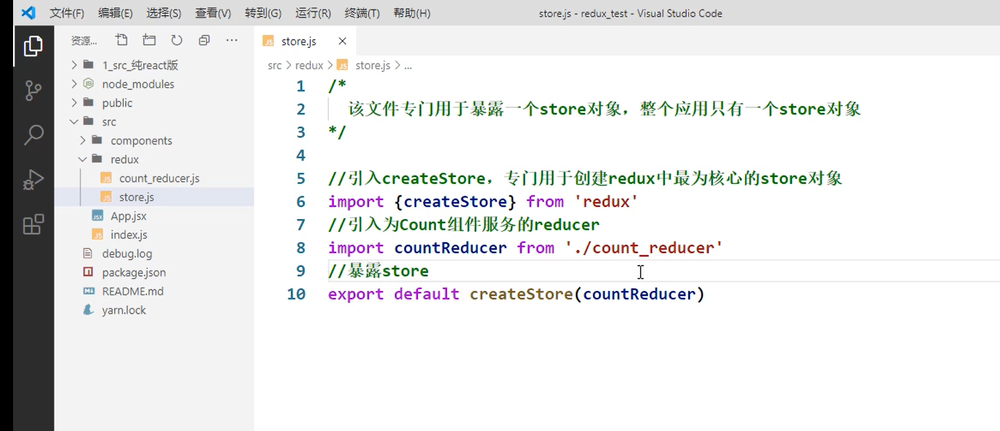
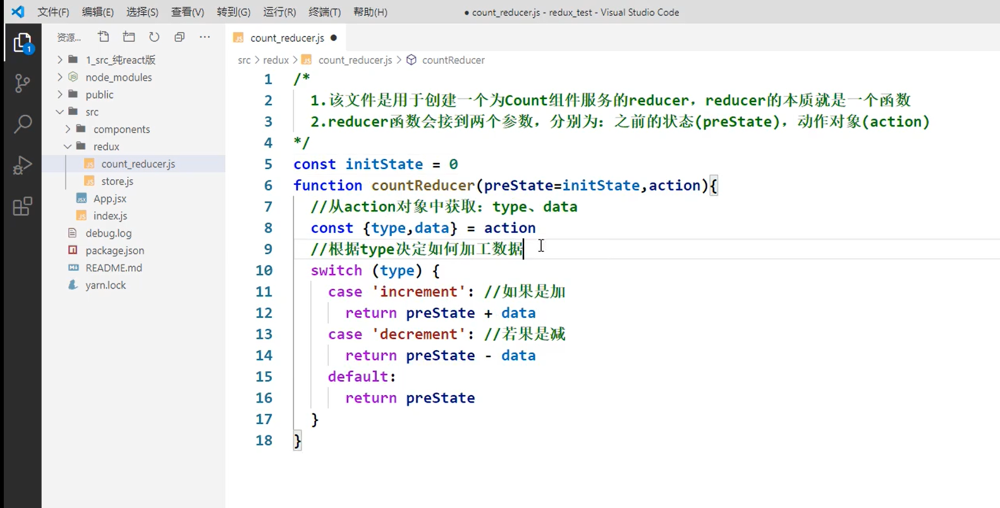

# React

## 1、【react入门】

**React** 是一个用于构建用户界面的 JavaScript 库。

- 是一个将数据渲染为 HTML 视图的开源 JS 库
- 它遵循基于组件的方法，有助于构建可重用的 UI 组件
- 它用于开发复杂的交互式的 web 和移动 UI

> React 有什么特点？

1. 使用虚拟 DOM 而不是真正的 DOM
2. 它可以用服务器渲染
3. 它遵循单向数据流或数据绑定
4. 高效
5. 声明式编码，组件化编码

> React 的一些主要优点？

1. 它提高了应用的性能
2. 可以方便在客户端和服务器端使用
3. 由于使用 JSX，代码的可读性更好
4. 使用React，编写 UI 测试用例变得非常容易

**为什么学？**

1.原生JS操作DOM繁琐，效率低

2.使用JS直接操作DOM,浏览器会进行大量的重绘重排

3.原生JS没有组件化编码方案，代码复用低

### React 基础案例

**首先需要引入几个 react 包**

- React 核心库、操作 DOM 的 react 扩展库、将 jsx 转为 js 的 babel 库

【先引入react.development.js，后引入react-dom.development.js】

> ```
> react.development.js
> ```
>
> - react 是react核心库，只要使用react就必须要引入
> - 下载地址：https://unpkg.com/react@18.0.0/umd/react.development.js
>
> ```
> react-dom.development.js
> ```
>
> - react-dom 是react的dom包，使用react开发web应用时必须引入
> - 下载地址：https://unpkg.com/react-dom@18.0.0/umd/react-dom.development.js
>
> ```
> babel.min.js 
> ```
>
> - 由于JSX最终需要转换为JS代码执行，所以浏览器并不能正常识别JSX，所以当我们在浏览器中直接使用JSX时，还必须引入babel来完成对代码的编译。
> - babel下载地址：https://unpkg.com/babel-standalone@6/babel.min.js

[](https://camo.githubusercontent.com/a99a41cd5b97d142eaf5c330ce9eaf9510a776fb26635ffaabf856fe81857510/68747470733a2f2f69302e6864736c622e636f6d2f6266732f616c62756d2f353134633564663066356638653732343263613137653163393339623438323262373136333135662e706e67)

```
react.development.js
react-dom.development.js
babel.min.js 
```

**创建一个容器**

**创建虚拟DOM，渲染到容器中**

```html
<!DOCTYPE html>
<html lang="en">
  <head>
    <meta charset="UTF-8" />
    <title>hello_react</title>
  </head>
  <body>
    <!-- 准备好一个“容器” -->
    <div id="test"></div>

    <!-- 引入react核心库 -->
    <script type="text/javascript" src="../js/react.development.js"></script>
    <!-- 引入react-dom，用于支持react操作DOM -->
    <script type="text/javascript" src="../js/react-dom.development.js"></script>
    <!-- 引入babel，用于将jsx转为js -->
    <script type="text/javascript" src="../js/babel.min.js"></script>

    <script type="text/babel">
      /* 此处一定要写babel */
      //1.创建虚拟DOM
      const VDOM = <h1>Hello</h1> /* 此处一定不要写引号，因为不是字符串 */
      //2.渲染虚拟DOM到页面
	const root = ReactDOM.createRoot(document.querySelector('#test'));
      root.render(VDOM);
    </script>
  </body>
</html>
```

> 后面很多地方没有用`createRoot`这种方式是因为一开始学的课程是2020年的，这是现在新的创建方式。
>
> 这里第一个案例采用新方式了

这样，就会在页面中的这个div容器上添加这个h1.

[](https://camo.githubusercontent.com/bc0a2ccedf56e79a1658c68d082bad810f28ad6094cca4b7a7e6e4cb090661ae/68747470733a2f2f69302e6864736c622e636f6d2f6266732f616c62756d2f376335373133663234386363323862636235333164326564613332356535363738396466343238362e706e67)

> - React.createElement()
>   - `React.createElement(type, [props], [...children])`
>   - 用来创建React元素
>   - React元素无法修改
> - ReactDOM.createRoot()
>   - `createRoot(container[, options])`
>   - 用来创建React的根容器，容器用来放置React元素
> - ReactDOM.render()
>   - `root.render(element)`
>   - 用来将React元素渲染到根元素中
>   - 根元素中所有的内容都会被删除，被React元素所替换
>   - 当重复调用render()时，React会将两次的渲染结果进行比较，
>   - 它会确保只修改那些发生变化的元素，对DOM做最少的修改

### jsx 语法

JSX 是 JavaScript 的语法扩展，JSX 使得我们可以以类似于 HTML 的形式去使用 JS。JSX便是React中声明式编程的体现方式。声明式编程，简单理解就是以结果为导向的编程。使用JSX将我们所期望的网页结构编写出来，然后React再根据JSX自动生成JS代码。所以我们所编写的JSX代码，最终都会转换为以调用`React.createElement()`创建元素的代码。

1. 定义虚拟DOM，JSX不是字符串，不要加引号
2. 标签中混入JS表达式的时候使用`{}`

```
id = {myId.toUpperCase()}
```

1. 样式的类名指定不能使用class，使用`className`
2. 内敛样式要使用`{{}}`包裹

```
style={{color:'skyblue',fontSize:'24px'}}
```

1. 不能有多个根标签，只能有一个根标签
2. JSX的标签必须正确结束（自结束标签必须写/）
3. JSX中html标签应该小写，**React组件应该大写开头**。如果小写字母开头，就将标签转化为 html 同名元素，如果 html 中无该标签对应的元素，就报错；如果是大写字母开头，react 就去渲染对应的组件，如果没有就报错
4. 如果表达式是空值、布尔值、undefined，将不会显示

> 关于JS表达式和JS语句：
>
> - JS表达式：返回一个值，可以放在任何一个需要值的地方 a a+b demo(a) arr.map() function text(){}
> - JS语句：if(){} for(){} while(){} swith(){} 不会返回一个值

**其它**

注释写在花括号里

```
ReactDOM.render(
    <div>
    <h1>小丞</h1>
    {/*注释...*/}
     </div>,
    document.getElementById('example')
);
```

1. `class`需要使用`className`代替
2. `style`中必须使用对象设置` style={{background:'red'}}`

```html
<style>
	.title{
		background-color: orange;
		width: 200px;
	}
</style>

<!-- 准备好一个“容器” -->
<div id="test"></div>

<script type="text/babel" >
	const myId = 'aTgUiGu'
	const myData = 'HeLlo,rEaCt'

	//1.创建虚拟DOM
	const VDOM = (
		<div>
			<h2 className="title" id={myId.toLowerCase()}>
				<span style={{color:'white',fontSize:'29px'}}>{myData.toLowerCase()}</span>
			</h2>
			<h2 className="title" id={myId.toLowerCase()}>
				<span style={{color:'white',fontSize:'29px'}}>{myData.toUpperCase()}</span>
			</h2>
			<input type="text"/>
		</div>
	)
	//2.渲染虚拟DOM到页面
	ReactDOM.render(VDOM,document.getElementById('test'))
</script>
```

[](https://camo.githubusercontent.com/df034886e2bf4fdf9d49680c68260ff71097e134b1abf0005a5ddb651cc117c4/68747470733a2f2f69302e6864736c622e636f6d2f6266732f616c62756d2f396434626166646537356362383266373962313761393134393163343665623835373662373834612e706e67)

**数组**

JSX 允许在模板中插入数组，数组自动展开全部成员

> {} 只能用来放js表达式，而不能放语句（if for） 在语句中是可以去操作JSX

```
var arr = [
  <h1>小丞</h1>,
  <h2>同学</h2>,
];
ReactDOM.render(
  <div>{arr}</div>,
  document.getElementById('example')
);
```

**tip: JSX 小练习**

根据动态数据生成 `li`

```
const data = ['A','B','C']
const VDOM = (
    <div>
        <ul>
            {
                data.map((item,index)=>{
                    return <li key={index}>{item}</li>
                })
            }
        </ul>
    </div>
)
ReactDOM.render(VDOM,document.querySelector('.test'))
```

[](https://camo.githubusercontent.com/4f56c35289a67876d644eeee4ac7cc52aa06ceb2c711947b81e81ce780ac35fc/68747470733a2f2f69302e6864736c622e636f6d2f6266732f616c62756d2f303932343139323331373864376664636131346430383765366631613936323764633362373038312e706e67)

### 两种创建虚拟DOM的方式

**使用JSX创建虚拟DOM**

```
//1.创建虚拟DOM
	const VDOM = (  /* 此处一定不要写引号，因为不是字符串 */
    	<h1 id="title">
			<span>Hello,React</span>
		</h1>
	)
//2.渲染虚拟DOM到页面
	ReactDOM.render(VDOM,document.querySelector('.test'))
```

这个在上面的案例中已经演示过了 ，下面看看另外一种创建虚拟DOM的方式

**2.使用JS创建虚拟DOM**

```JavaScript
/*
* React.createElement()
*   - 用来创建一个React元素
*   - 参数：
*        1.元素的名称（html标签必须小写）
*        2.标签中的属性
*           - class属性需要使用className来设置
*           - 在设置事件时，属性名需要修改为驼峰命名法
*       3.元素的内容（子元素）
*   - 注意点：
*       React元素最终会通过虚拟DOM转换为真实的DOM元素
*       React元素一旦创建就无法修改，只能通过新创建的元素进行替换
* */
//1.创建虚拟DOM,创建嵌套格式的dom
const VDOM=React.createElement('h1',{id:'title'},React.createElement('span',{},'hello,React'))
//2.渲染虚拟DOM到页面
ReactDOM.render(VDOM,document.querySelector('.test'))
```

使用JS和JSX都可以创建虚拟DOM，但是可以看出JS创建虚拟DOM比较繁琐，尤其是标签如果很多的情况下，所以还是比较推荐使用JSX来创建。

### 两种DOM的区别

```HTML
    <!-- 准备好一个“容器” -->
    <div id="test"></div>

<script type="text/babel">
      /* 此处一定要写babel */
      //1.创建虚拟DOM
      const VDOM = <h1>Hello,React</h1> /* 此处一定不要写引号，因为不是字符串 */
      //2.渲染虚拟DOM到页面
      ReactDOM.render(VDOM, document.getElementById('test'))
      const TDOM = document.querySelector('#test')
      console.log('虚拟DOM', VDOM)
      console.dir('真实DOM')
      console.dir(TDOM)
      //   debugger
      console.log(typeof VDOM)
      console.log(VDOM instanceof Object)
</script>
```

[](https://camo.githubusercontent.com/aab669ce79c27362f0f1296cb47639847be8a21f4be366cce4902cccc7131f47/68747470733a2f2f69302e6864736c622e636f6d2f6266732f616c62756d2f336339633335333333633038383361313035376264346338326265386266626639623639663034622e706e67)

**关于虚拟DOM：**

  1. 本质是Object类型的对象（一般对象）

  2. 虚拟DOM比较“轻”，真实DOM比较“重”，因为虚拟DOM是React内部在用，无需真实DOM上那么多的属性。

  3. 虚拟DOM最终会被React转化为真实DOM，呈现在页面上。


## 2、【面向组件编程】

### 2.1 组件的使用

当应用是以多组件的方式实现，这个应用就是一个组件化的应用

只有两种方式的组件

- 函数组件
- 类式组件

> **注意：**
>
> 1. 组件名必须是首字母大写（React 会将以小写字母开头的组件视为原生 DOM 标签。例如，< div />`代表 HTML 的 div 标签，而`< Weclome /> 则代表一个组件，并且需在作用域内使用 `Welcome`）
> 2. 虚拟DOM元素只能有一个根元素
> 3. 虚拟DOM元素必须有结束标签 `< />`

**渲染类组件标签的基本流程**

1. React 内部会创建组件实例对象
2. 调用`render()`得到虚拟 DOM ,并解析为真实 DOM
3. 插入到指定的页面元素内部

####  函数式组件

定义组件最简单的方式就是编写 JavaScript 函数：

```js
 //1.创建函数式组件
      function MyComponent(props) {
        console.log(this) //此处的this是undefined，因为babel编译后开启了严格模式
        return <h2>我是用函数定义的组件(适用于【简单组件】的定义)</h2>
      }

 //2.渲染组件到页面
      ReactDOM.render(<MyComponent />, document.getElementById('test'))
```

该函数是一个有效的 `React` 组件，因为它接收唯一带有数据的`props`（代表属性）对象与并返回一个 `React` 元素。这类组件被称为“函数组件”，因为它本质上就是 `JavaScript` 函数。

让我们来回顾一下这个例子中发生了什么：

1. `React`解析组件标签，找到了`MyComponent`组件。

2. 发现组件是使用函数定义的，随后调用该函数，将返回的虚拟DOM转为真实DOM，随后呈现在页面中。

**注意：** **组件名称必须以大写字母开头。**

React 会将以小写字母开头的组件视为原生 DOM 标签。例如，`<div />` 代表 HTML 的 div 标签，而 `<Welcome />` 则代表一个组件，并且需在作用域内使用 `Welcome`。

你可以在[深入 JSX](https://zh-hans.reactjs.org/docs/jsx-in-depth.html#user-defined-components-must-be-capitalized) 中了解更多关于此规范的原因。

#### 类式组件

> **将函数组件转换成 class 组件**
>
> 通过以下五步将函数组件转成 class 组件：
>
> 1. 创建一个同名的 [ES6 class](https://developer.mozilla.org/en/docs/Web/JavaScript/Reference/Classes)，并且继承于 `React.Component`。
> 2. 添加一个空的 `render()` 方法。
> 3. 将函数体移动到 `render()` 方法之中。
> 4. 在 `render()` 方法中使用 `this.props` 替换 `props`。
> 5. 删除剩余的空函数声明。

```js
class MyComponent extends React.Component {
        render() {
          console.log('render中的this:', this)
          return <h2>我是用类定义的组件(适用于【复杂组件】的定义)</h2>
        }
      }

ReactDOM.render(<MyComponent />, document.getElementById('test'))
```

每次组件更新时 `render` 方法都会被调用，但只要在相同的 `DOM` 节点中渲染 `<MyComponent/>` ，就仅有一个 `MyComponent` 组件的 `class` 实例被创建使用。这就使得我们可以使用如 `state` 或生命周期方法等很多其他特性。

**执行过程：**

1. `React`解析组件标签，找到相应的组件

2. 发现组件是类定义的，随后`new`出来的类的实例，并通过该实例调用到原型上的`render`方法

3. 将`render`返回的虚拟`DOM`转化为真实的`DOM`,随后呈现在页面中

#### 组合组件

组件可以在其输出中引用其他组件。这就可以让我们用同一组件来抽象出任意层次的细节。按钮，表单，对话框，甚至整个屏幕的内容：在 `React` 应用程序中，这些通常都会以组件的形式表示。

例如，我们可以创建一个可以多次渲染 `Welcome` 组件的 `App` 组件：

```js
function Welcome(props) {
  return <h1>Hello, {props.name}</h1>;
}

function App() {
  return (
    <div>
      <Welcome name="Sara" />      
      <Welcome name="Cahal" />      
      <Welcome name="Edite" />    
     </div>
  );
}
```


通常来说，每个新的 `React` 应用程序的顶层组件都是 `App` 组件。但是，如果你将 `React` 集成到现有的应用程序中，你可能需要使用像 `Button` 这样的小组件，并自下而上地将这类组件逐步应用到视图层的每一处。

#### 提取组件

将组件拆分为更小的组件。

例如，参考如下 `Comment` 组件：

```js
function formatDate(date) {
	return date.toLocaleDateString()
}

function Comment(props) {
    return (
      <div className="Comment">
        <div className="UserInfo">
          
          <div className="UserInfo-name">{props.author.name}</div>
        </div>
        <div className="Comment-text">{props.text}</div>
        <div className="Comment-date">{formatDate(props.date)}</div>
      </div>
    )
}

const comment = {
    date: new Date(),
    text: 'I hope you enjoy learning React!',
    author: {
      name: 'Hello Kitty',
      avatarUrl: 'http://placekitten.com/g/64/64',
    },
}

ReactDOM.render(
<Comment date={comment.date} text={comment.text} author={comment.author} />,
document.getElementById('test'),
)
```

**[在 CodePen 上试试](https://codepen.io/gaearon/pen/VKQwEo?editors=1010)**

该组件用于描述一个社交媒体网站上的评论功能，它接收 `author`（对象），`text` （字符串）以及 `date`（日期）作为 `props`。


该组件由于嵌套的关系，变得难以维护，且很难复用它的各个部分。因此，让我们从中提取一些组件出来。

首先，我们将提取 `Avatar` 组件：

```js
function Avatar(props) {
  return (
      );
}
```

`Avatar` 不需知道它在 `Comment` 组件内部是如何渲染的。因此，我们给它的 props 起了一个更通用的名字：`user`，而不是 `author`。

我们建议从组件自身的角度命名 props，而不是依赖于调用组件的上下文命名。

我们现在针对 `Comment` 做些微小调整：

```js
  function Avatar(props) {
    return 
  }

  function Comment(props) {
    return (
      <div className="Comment">
        <div className="UserInfo">
          <Avatar user={props.author} />
          <div className="UserInfo-name">{props.author.name}</div>
        </div>
        <div className="Comment-text">{props.text}</div>
        <div className="Comment-date">{formatDate(props.date)}</div>
      </div>
    )
  }
```

接下来，我们将提取 `UserInfo` 组件，该组件在用户名旁渲染 `Avatar` 组件：

```js
function UserInfo(props) {
  return (
    <div className="UserInfo">
      <Avatar user={props.user} />
      <div className="UserInfo-name">
        {props.user.name}
      </div>
    </div>
  );
}
```

进一步简化 `Comment` 组件：

```js
  function Avatar(props) {
    return 
  }

  function UserInfo(props) {
    return (
      <div className="UserInfo">
        <Avatar user={props.user} />
        <div className="UserInfo-name">{props.user.name}</div>
      </div>
    )
  }

  function Comment(props) {
    return (
      <div className="Comment">
        <UserInfo user={props.author} />
        <div className="Comment-text">{props.text}</div>
        <div className="Comment-date">{formatDate(props.date)}</div>
      </div>
    )
  }
```

**[在 CodePen 上试试](https://codepen.io/gaearon/pen/rrJNJY?editors=1010)**

最初看上去，提取组件可能是一件繁重的工作，但是，在大型应用中，构建可复用组件库是完全值得的。根据经验来看，如果 UI 中有一部分被多次使用（`Button`，`Panel`，`Avatar`），或者组件本身就足够复杂（`App`，`FeedStory`，`Comment`），那么它就是一个可提取出独立组件的候选项。

### 2.2 组件实例的三大属性

#### state

**基本使用**

> 我们都说React是一个状态机，体现是什么地方呢，就是体现在state上，通过与用户的交互，实现不同的状态，然后去渲染UI,这样就让用户的数据和界面保持一致了。state是组件的私有属性。
>
> 在React中，更新组件的state，结果就会重新渲染用户界面(不需要操作DOM),一句话就是说，用户的界面会随着状态的改变而改变。
>
> state是组件对象最重要的属性，值是对象（可以包含多个key-value的组合）
>
> 简单的说就是组件的状态，也就是该组件所存储的数据

**案例**：

需求：页面显示【今天天气很炎热】，鼠标点击文字的时候，页面更改为【今天天气很凉爽】

核心代码如下：

````js
<body>
    <!-- 准备好容器 -->
    <div id="test">
        
    </div>
</body>

<!--这里使用了js来创建虚拟DOM-->
<script type="text/babel">
        //1.创建组件
        class St extends React.Component{
            constructor(props){
                super(props);
                //先给state赋值
                this.state = {isHot:true,win:"ss"};
                //找到原型的dem，根据dem函数创建了一个dem1的函数，并且将实例对象的this赋值过去
                this.dem1 = this.dem.bind(this);
            }
            //render会调用1+n次【1就是初始化的时候调用的，n就是每一次修改state的时候调用的】
            render(){ //这个This也是实例对象
                //如果加dem()，就是将函数的回调值放入这个地方
                //this.dem这里面加入this，并不是调用，只不过是找到了dem这个函数，在调用的时候相当于直接调用，并不是实例对象的调用
                return <h1 onClick = {this.dem1}>今天天气很{this.state.isHot?"炎热":"凉爽"}</h1>    
            }
            //通过state的实例调用dem的时候，this就是实例对象
            dem(){
                const state =  this.state.isHot;
                 //状态中的属性不能直接进行更改，需要借助API
                // this.state.isHot = !isHot; 错误
                //必须使用setState对其进行修改，并且这是一个合并
                this.setState({isHot:!state});
            }
        }
        // 2.渲染，如果有多个渲染同一个容器，后面的会将前面的覆盖掉
        ReactDOM.render(<St/>,document.getElementById("test"));
</script>
````

在**类式组件**的函数中，直接修改`state`值

```js
this.state.isHot = false
```

> 页面的渲染靠的是`render`函数

这时候会发现页面内容不会改变，原因是 React 中不建议 `state`不允许直接修改，而是通过类的原型对象上的方法 `setState()`

**注意：**

1. 组件的构造函数，必须要传递一个`props`参数

2. 特别关注`this`【重点】，类中所有的方法局部都开启了严格模式，如果直接进行调用，`this`就是`undefined`

3. 想要改变`state`,需要使用`setState`进行修改，如果只是修改`state`的部分属性，则不会影响其他的属性，这个只是合并并不是覆盖。

**在优化过程中遇到的问题**

1. 组件中的 `render` 方法中的 `this` 为组件实例对象
2. 组件自定义方法中由于开启了严格模式，`this` 指向`undefined`如何解决
   1. 通过 `bind` 改变 `this` 指向
   2. 推荐采用箭头函数，箭头函数的 `this` 指向
3. `state` 数据不能直接修改或者更新

**setState()**

`this.setState()`，该方法接收两种参数：对象或函数。

```js
this.setState(partialState, [callback]);
```

- `partialState`: 需要更新的状态的部分对象
- `callback`: 更新完状态后的回调函数

**有两种写法:**

1. 对象：即想要修改的`state`

   ```js
   this.setState({
       isHot: false
   })
   ```

2. 函数：接收两个函数，第一个函数接受两个参数，第一个是当前state，第二个是当前props，该函数返回一个对象，和直接传递对象参数是一样的，就是要修改的`state`；第二个函数参数是`state`改变后触发的回调

```js
this.setState(state => ({count: state.count+1});
```

- 在执行 `setState`操作后，`React` 会自动调用一次 `render()`
- `render()` 的执行次数是 1+n (1 为初始化时的自动调用，n 为状态更新的次数)

**简化版本**

1. `state`的赋值可以不再构造函数中进行

2. 使用了箭头函数，将`this`进行了改变

```js
<body>
    <!-- 准备好容器 -->
    <div id="test">
        
    </div>
</body>

<script type="text/babel">
        class St extends React.Component{
            //可以直接对其进行赋值
            state = {isHot:true};
            render(){ //这个This也是实例对象
                return <h1 onClick = {this.dem}>今天天气很{this.state.isHot?"炎热":"凉爽"}</h1>    
                //或者使用{()=>this.dem()也是可以的}
            }
            //箭头函数 [自定义方法--->要用赋值语句的形式+箭头函数]
            dem = () =>{
                console.log(this);
                const state =  this.state.isHot;
                this.setState({isHot:!state});
            }
        }
        ReactDOM.render(<St />,document.getElementById("test"));       
</script>
```

如果想要在调用方法的时候传递参数，有两个方法：

```js
<button onClick={(e) => this.deleteRow(id, e)}>Delete Row</button>
<button onClick={this.deleteRow.bind(this, id)}>Delete Row</button>
```

上述两种方式是等价的，分别通过**箭头函数**和 [`Function.prototype.bind`](https://developer.mozilla.org/en-US/docs/Web/JavaScript/Reference/Global_objects/Function/bind) 来实现。

在这两种情况下，`React` 的事件对象 `e` 会被作为第二个参数传递。如果通过箭头函数的方式，事件对象必须显式的进行传递，而通过 `bind` 的方式，事件对象以及更多的参数将会被隐式的进行传递。

**State 的更新可能是异步的**

**React控制之外的事件中调用setState是同步更新的。比如原生js绑定的事件，setTimeout/setInterval等**。

> 18版本中测试setTimeout回调函数中也是异步更新的

**大部分开发中用到的都是React封装的事件，比如onChange、onClick、onTouchMove等，这些事件处理程序中的setState都是异步处理的。**

```js
//1.创建组件
class St extends React.Component{
    //可以直接对其进行赋值
    state = {isHot:10};
    render(){ //这个This也是实例对象
        return <h1 onClick = {this.dem}>点击事件</h1> 
    }
//箭头函数 [自定义方法--->要用赋值语句的形式+箭头函数]
    dem = () =>{
        //修改isHot
        this.setState({ isHot: this.state.isHot + 1})
        console.log(this.state.isHot);
    }
}
```

上面的案例中预期`setState`使得`isHot`变成了11，输出也应该是11。然而在控制台打印的却是10，也就是并没有对其进行更新。这是因为异步的进行了处理，在输出的时候还没有对其进行处理。

```js
document.getElementById("test").addEventListener("click",()=>{
        this.setState({isHot: this.state.isHot + 1});
        console.log(this.state.isHot);
    })
}
```

但是通过这个原生JS的，可以发现，控制台打印的就是11，也就是已经对其进行了处理。也就是进行了同步的更新。

**React怎么调用同步或者异步的呢？**

​	在 `React` 的 `setState` 函数实现中，会根据一个变量 `isBatchingUpdates` 判断是直接更新 `this.state` 还是放到队列中延时更新，而 `isBatchingUpdates` 默认是 `false`，表示 `setState` 会同步更新 `this.state`；但是，有一个函数 `batchedUpdates`，该函数会把 `isBatchingUpdates` 修改为 `true`，而当 `React` 在调用事件处理函数之前就会先调用这个 `batchedUpdates`将`isBatchingUpdates`修改为`true`，这样由 `React` 控制的事件处理过程 `setState` 不会同步更新 `this.state`。

​	**如果是同步更新，每一个setState会调用一个render，并且如果多次调用setState会以最后调用的为准，前面的将会作废；如果是异步更新，多个setSate会统一调用一次render**

```js
dem = () =>{
    this.setState({
        isHot:  1,
        cont:444
    })
    this.setState({
    	isHot: this.state.isHot + 1

    })
    this.setState({
        isHot:  888,
        cont:888
    })
}
```

上面的最后会输出：isHot是888，cont是888

```js
 dem = ()=> {  
    this.setState({
        isHot: this.state.isHot + 1,

    })
    this.setState({
        isHot: this.state.isHot + 1,

    })
    this.setState({
        isHot: this.state.isHot + 888
    })
}
```

初始isHot为10，最后isHot输出为898，也就是前面两个都没有执行。

**注意！！这是异步更新才有的，如果同步更新，每一次都会调用render，这样每一次更新都会 **

**异步更新解决方案**

出于性能考虑，React 可能会把多个 `setState()` 调用合并成一个调用。

因为 `this.props` 和 `this.state` 可能会异步更新，所以你不要依赖他们的值来更新下一个状态。

例如，此代码可能会无法更新计数器：

```js
// Wrong
this.setState({
  counter: this.state.counter + this.props.increment,
});
```

要解决这个问题，可以让 `setState()` 接收一个函数而不是一个对象。这个函数用上一个 state 作为第一个参数，将此次更新被应用时的 props 做为第二个参数：

```js
// Correct
this.setState((state, props) => ({
  counter: state.counter + props.increment
}));
```

上面使用了[箭头函数](https://developer.mozilla.org/en-US/docs/Web/JavaScript/Reference/Functions/Arrow_functions)，不过使用普通的函数也同样可以：

```js
// Correct
this.setState(function(state, props) {
  return {
    counter: state.counter + props.increment
  };
});
```

**数据是向下流动的**

​	不管是**父组件**或是**子组件**都无法知道某个组件是**有状态**的还是**无状态**的，并且它们也并不关心它是函数组件还是 `class` 组件。这就是为什么称 `state` 为局部的或是封装的的原因。除了拥有并设置了它的组件，其他组件都无法访问。

组件可以选择把它的 `state` 作为 `props` 向下传递到它的子组件中：

```js
<FormattedDate date={this.state.date} />
```

`FormattedDate` 组件会在其 `props` 中接收参数 `date`，但是组件本身无法知道它是来自于 `Clock` 的 state，或是 `Clock` 的 props，还是手动输入的：

```js
function FormattedDate(props) {
  return <h2>It is {props.date.toLocaleTimeString()}.</h2>;
}
```

[**在 CodePen 上尝试**](https://codepen.io/gaearon/pen/zKRqNB?editors=0010)

​	这通常会被叫做“**自上而下**”或是“**单向**”的**数据流**。任何的 `state` 总是所属于特定的组件，而且从该 `state` 派生的任何数据或 UI 只能影响树中“**低于**”它们的组件。

​	如果你把一个以组件构成的树想象成一个 props 的数据瀑布的话，那么每一个组件的 state 就像是在任意一点上给瀑布增加额外的水源，但是它只能向下流动。

为了证明每个组件都是真正独立的，我们可以创建一个渲染三个 `Clock` 的 `App` 组件：

```js
function App() {
  return (
    <div>
      <Clock />      
      <Clock />      
      <Clock />    
     </div>
  );
}
```

[**在 CodePen 上尝试**](https://codepen.io/gaearon/pen/vXdGmd?editors=0010)

每个 `Clock` 组件都会单独设置它自己的计时器并且更新它。

在 `React` 应用中，组件是**有状态组件**还是**无状态组件**属于组件实现的细节，它可能会随着时间的推移而改变。你可以在有状态的组件中使用无状态的组件，反之亦然。

#### props

**基本使用**

与`state`不同，`state`是组件自身的状态，而`props`则是外部传入的数据

基本使用：

```js
<body>
    <div id = "div">

    </div>

</body>
<script type="text/babel">
    class Person extends React.Component{
        render(){
          const { name, age, sex } = this.props
            return (
                <ul>
                  <li>姓名：{name}</li>
                  <li>性别：{sex}</li>
                  <li>年龄：{age + 1}</li>
                </ul>
          )
        }
    }
    //传递数据
    ReactDOM.render(<Person name="tom" age = {41} sex="男"/>,document.getElementById("div"));
</script>
```

如果传递的数据是一个对象，可以更加简便的使用

```js
<script type="text/babel">
    class Person extends React.Component{
        render(){
            return (
                <ul>
                    <li>{this.props.name}</li>
                    <li>{this.props.age}</li>
                    <li>{this.props.sex}</li>
                </ul>
            )
        }
    }
    const p = {name:"张三",age:"18",sex:"女"}
   ReactDOM.render(<Person {...p}/>,document.getElementById("div"));
</script>
```

`...` 展开运算符，主要用来展开数组，如下面这个例子：

```js
arr = [1,2,3];
arr1 = [4,5,6];
arr2 = [...arr,...arr1];  //arr2 = [1,2,3,4,5,6]
```

但是他还有其他的用法：

1.复制一个对象给另一个对象{...对象名}。此时这两个对象并没有什么联系了

```js
const p1 = {name:"张三",age:"18",sex:"女"}
const p2 = {...p1};
p1.name = "sss";
console.log(p2)  //{name:"张三",age:"18",sex:"女"}
```

2.在复制的时候，合并其中的属性

```js
 const p1 = {name:"张三",age:"18",sex:"女"}
 const p2 = {...p1,name : "111",hua:"ss"};
 p1.name = "sss";
 console.log(p2)  //{name: "111", age: "18", sex: "女",hua:"ss"}
```

**注意！！** **{...P}并不能展开一个对象**

**props传递一个对象，是因为babel+react使得{..p}可以展开对象，但是只有在标签中才能使用**

**props限制**

> 注意：
>
> 自 React v15.5 起，`React.PropTypes` 已移入另一个包中。请使用 [`prop-types` 库](https://www.npmjs.com/package/prop-types) 代替。
>
> 我们提供了一个 [codemod 脚本](https://zh-hans.reactjs.org/blog/2017/04/07/react-v15.5.0.html#migrating-from-reactproptypes)来做自动转换。

随着你的应用程序不断增长，你可以通过类型检查捕获大量错误。对于某些应用程序来说，你可以使用 [Flow](https://flow.org/) 或 [TypeScript](https://www.typescriptlang.org/) 等 JavaScript 扩展来对整个应用程序做类型检查。但即使你不使用这些扩展，React 也内置了一些类型检查的功能。要在组件的 props 上进行类型检查，你只需配置特定的 `propTypes` 属性：

react对此提供了相应的解决方法：

- propTypes:类型检查，还可以限制不能为空
- defaultProps：默认值

> 从 ES2022 开始，你也可以在 React 类组件中将 `defaultProps` 声明为静态属性。欲了解更多信息，请参阅 [class public static fields](https://developer.mozilla.org/en-US/docs/Web/JavaScript/Reference/Classes/Public_class_fields#public_static_fields)。这种现代语法需要添加额外的编译步骤才能在老版浏览器中工作。

```js
<!-- 准备好一个“容器” -->
<div id="test1"></div>
<div id="test2"></div>
<div id="test3"></div>

<script type="text/babel">
    //创建组件
    class Person extends React.Component{
        render(){
            // console.log(this);
            const {name,age,sex} = this.props
            //props是只读的
            //this.props.name = 'jack' //此行代码会报错，因为props是只读的
            return (
                <ul>
                    <li>姓名：{name}</li>
                    <li>性别：{sex}</li>
                    <li>年龄：{age+1}</li>
                </ul>
            )
        }
    }
    //对标签属性进行类型、必要性的限制
    Person.propTypes = {
        name:PropTypes.string.isRequired, //限制name必传，且为字符串
        sex:PropTypes.string,//限制sex为字符串
        age:PropTypes.number,//限制age为数值
        speak:PropTypes.func,//限制speak为函数
    }
    //指定默认标签属性值
    Person.defaultProps = {
        sex:'男',//sex默认值为男
        age:18 //age默认值为18
    }
    //渲染组件到页面
    ReactDOM.render(<Person name={100} speak={speak}/>,document.getElementById('test1'))
    ReactDOM.render(<Person name="tom" age={18} sex="女"/>,document.getElementById('test2'))

    const p = {name:'老刘',age:18,sex:'女'}
    // console.log('@',...p);
    // ReactDOM.render(<Person name={p.name} age={p.age} sex={p.sex}/>,document.getElementById('test3'))
    ReactDOM.render(<Person {...p}/>,document.getElementById('test3'))

    function speak(){
        console.log('我说话了');
    }
</script>
```

当传入的 `prop` 值类型不正确时，JavaScript 控制台将会显示警告。出于性能方面的考虑，`propTypes` 仅在开发模式下进行检查。

`defaultProps` 用于确保 `this.props.sex` 在父组件没有指定其值时，有一个默认值。`propTypes` 类型检查发生在 `defaultProps` 赋值后，所以类型检查也适用于 `defaultProps`。

**PropTypes**

以下提供了使用不同验证器的例子：

```js
import PropTypes from 'prop-types';

MyComponent.propTypes = {
  // 你可以将属性声明为 JS 原生类型，默认情况下
  // 这些属性都是可选的。
  optionalArray: PropTypes.array,
  optionalBool: PropTypes.bool,
  optionalFunc: PropTypes.func,
  optionalNumber: PropTypes.number,
  optionalObject: PropTypes.object,
  optionalString: PropTypes.string,
  optionalSymbol: PropTypes.symbol,

  // 任何可被渲染的元素（包括数字、字符串、元素或数组）
  // (或 Fragment) 也包含这些类型。
  optionalNode: PropTypes.node,

  // 一个 React 元素。
  optionalElement: PropTypes.element,

  // 一个 React 元素类型（即，MyComponent）。
  optionalElementType: PropTypes.elementType,

  // 你也可以声明 prop 为类的实例，这里使用
  // JS 的 instanceof 操作符。
  optionalMessage: PropTypes.instanceOf(Message),

  // 你可以让你的 prop 只能是特定的值，指定它为
  // 枚举类型。
  optionalEnum: PropTypes.oneOf(['News', 'Photos']),

  // 一个对象可以是几种类型中的任意一个类型
  optionalUnion: PropTypes.oneOfType([
    PropTypes.string,
    PropTypes.number,
    PropTypes.instanceOf(Message)
  ]),

  // 可以指定一个数组由某一类型的元素组成
  optionalArrayOf: PropTypes.arrayOf(PropTypes.number),

  // 可以指定一个对象由某一类型的值组成
  optionalObjectOf: PropTypes.objectOf(PropTypes.number),

  // 可以指定一个对象由特定的类型值组成
  optionalObjectWithShape: PropTypes.shape({
    color: PropTypes.string,
    fontSize: PropTypes.number
  }),

  // 具有额外属性警告的对象
  optionalObjectWithStrictShape: PropTypes.exact({
    name: PropTypes.string,
    quantity: PropTypes.number
  }),

  // 你可以在任何 PropTypes 属性后面加上 `isRequired` ，确保
  // 这个 prop 没有被提供时，会打印警告信息。
  requiredFunc: PropTypes.func.isRequired,

  // 任意类型的必需数据
  requiredAny: PropTypes.any.isRequired,

  // 你可以指定一个自定义验证器。它在验证失败时应返回一个 Error 对象。
  // 请不要使用 `console.warn` 或抛出异常，因为这在 `oneOfType` 中不会起作用。
  customProp: function(props, propName, componentName) {
    if (!/matchme/.test(props[propName])) {
      return new Error(
        'Invalid prop `' + propName + '` supplied to' +
        ' `' + componentName + '`. Validation failed.'
      );
    }
  },

  // 你也可以提供一个自定义的 `arrayOf` 或 `objectOf` 验证器。
  // 它应该在验证失败时返回一个 Error 对象。
  // 验证器将验证数组或对象中的每个值。验证器的前两个参数
  // 第一个是数组或对象本身
  // 第二个是他们当前的键。
  customArrayProp: PropTypes.arrayOf(function(propValue, key, componentName, location, propFullName) {
    if (!/matchme/.test(propValue[key])) {
      return new Error(
        'Invalid prop `' + propFullName + '` supplied to' +
        ' `' + componentName + '`. Validation failed.'
      );
    }
  })
};
```

**限制单个元素**

你可以通过 `PropTypes.element` 来确保传递给组件的 children 中只包含一个元素。

```js
import PropTypes from 'prop-types';

class MyComponent extends React.Component {
  render() {
    // 这必须只有一个元素，否则控制台会打印警告。
    const children = this.props.children;
    return (
      <div>
        {children}
      </div>
    );
  }
}

MyComponent.propTypes = {
  children: PropTypes.element.isRequired
};
```

**简写方式**

```js
<!-- 准备好一个“容器” -->
<div id="test1"></div>
<div id="test2"></div>
<div id="test3"></div>


<script type="text/babel">
    //创建组件
    class Person extends React.Component{

        constructor(props){
            //构造器是否接收props，是否传递给super，取决于：是否希望在构造器中通过this访问props
            // console.log(props);
            super(props)
            console.log('constructor',this.props);
        }

        //对标签属性进行类型、必要性的限制
        static propTypes = {
            name:PropTypes.string.isRequired, //限制name必传，且为字符串
            sex:PropTypes.string,//限制sex为字符串
            age:PropTypes.number,//限制age为数值
        }

        //指定默认标签属性值
        static defaultProps = {
            sex:'男',//sex默认值为男
            age:18 //age默认值为18
        }

        render(){
            // console.log(this);
            const {name,age,sex} = this.props
            //props是只读的
            //this.props.name = 'jack' //此行代码会报错，因为props是只读的
            return (
                <ul>
                    <li>姓名：{name}</li>
                    <li>性别：{sex}</li>
                    <li>年龄：{age+1}</li>
                </ul>
            )
        }
    }

    //渲染组件到页面
    ReactDOM.render(<Person name="jerry"/>,document.getElementById('test1'))
</script>
```

在使用的时候可以通过 `this.props`来获取值 类式组件的 `props`:

1. 通过在组件标签上传递值，在组件中就可以获取到所传递的值
2. 在构造器里的`props`参数里可以获取到 `props`
3. 可以分别设置 `propTypes` 和 `defaultProps` 两个属性来分别操作 `props`的规范和默认值，两者都是直接添加在类式组件的**原型对象**上的（所以需要添加 `static`）
4. 同时可以通过`...`运算符来简化

**函数式组件的使用**

> 函数在使用props的时候，是作为参数进行使用的(props)

```js
<!DOCTYPE html>
<html lang="en">
  <head>
    <meta charset="UTF-8" />
    <title>对props进行限制</title>
  </head>
  <body>
    <!-- 准备好一个“容器” -->
    <div id="test1"></div>

    <script type="text/babel">
      //创建组件
      function Person(props) {
        const { name, age, sex } = props
        return (
          <ul>
            <li>姓名：{name}</li>
            <li>性别：{sex}</li>
            <li>年龄：{age}</li>
          </ul>
        )
      }
      Person.propTypes = {
        name: PropTypes.string.isRequired, //限制name必传，且为字符串
        sex: PropTypes.string, //限制sex为字符串
        age: PropTypes.number, //限制age为数值
      }

      //指定默认标签属性值
      Person.defaultProps = {
        sex: '男', //sex默认值为男
        age: 18, //age默认值为18
      }
      //渲染组件到页面
      ReactDOM.render(<Person name="jerry" />, document.getElementById('test1'))
    </script>
  </body>
</html>
```

函数组件的 `props`定义:

1. 在组件标签中传递 `props`的值
2. 组件函数的参数为 `props`
3. 对 `props`的限制和默认值同样设置在原型对象上

**props 的只读性**

组件无论是使用[函数声明还是通过 class 声明](https://zh-hans.reactjs.org/docs/components-and-props.html#function-and-class-components)，都绝不能修改自身的 props。来看下这个 `sum` 函数：

```js
function sum(a, b) {
  return a + b;
}
```

这样的函数被称为[“纯函数”](https://en.wikipedia.org/wiki/Pure_function)，因为该函数不会尝试更改入参，且多次调用下相同的入参始终返回相同的结果。

相反，下面这个函数则不是纯函数，因为它更改了自己的入参：

```js
function withdraw(account, amount) {
  account.total -= amount;
}
```

React 非常灵活，但它也有一个严格的规则：

**所有 React 组件都必须像纯函数一样保护它们的 props 不被更改。**

当然，应用程序的 UI 是动态的，并会伴随着时间的推移而变化。`state`在不违反上述规则的情况下，state 允许 React 组件随用户操作、网络响应或者其他变化而动态更改输出内容。

#### refs

`Refs` 提供了一种方式，允许我们访问 `DOM` 节点或在 `render` 方法中创建的 `React` 元素。

在典型的 `React` 数据流中，[props](https://zh-hans.reactjs.org/docs/components-and-props.html) 是父组件与子组件交互的唯一方式。要修改一个子组件，你需要使用新的 `props` 来重新渲染它。但是，在某些情况下，你需要在典型数据流之外强制修改子组件。被修改的子组件可能是一个 `React` 组件的实例，也可能是一个 `DOM` 元素。对于这两种情况，`React` 都提供了解决办法。

> 在我们正常的操作节点时，需要采用DOM API 来查找元素，但是这样违背了 React 的理念，因此有了`refs`

**何时使用 Refs**

下面是几个适合使用 `refs` 的情况：

- 管理焦点，文本选择或媒体播放。
- 触发强制动画。
- 集成第三方 DOM 库。

避免使用 `refs` 来做任何可以通过声明式实现来完成的事情。

**有三种操作`refs`的方法，分别为：**

- 字符串形式
- 回调形式
- `createRef`形式

**勿过度使用 Refs**

你可能首先会想到使用 refs 在你的 app 中“让事情发生”。如果是这种情况，请花一点时间，认真再考虑一下 state 属性应该被安排在哪个组件层中。通常你会想明白，让更高的组件层级拥有这个 state，是更恰当的。查看 [状态提升](https://zh-hans.reactjs.org/docs/lifting-state-up.html) 以获取更多有关示例。

**字符串形式**

在想要获取到一个`DOM`节点，可以直接在这个节点上添加`ref`属性。利用该属性进行获取该节点的值。

案例：给需要的节点添加`ref`属性，此时该实例对象的`refs`上就会有这个值。就可以利用实例对象的`refs`获取已经添加节点的值

```js
<input ref="dian" type="text" placeholder="点击弹出" />

inputBlur = () =>{
            alert(this.refs.shiqu.value);
}
```

**注意**

不建议使用它，因为 string 类型的 refs 存在 [一些问题](https://github.com/facebook/react/pull/8333#issuecomment-271648615)。它已过时并可能会在未来的版本被移除。

如果你目前还在使用 `this.refs.textInput` 这种方式访问 `refs` ，我们建议用[回调函数](https://zh-hans.reactjs.org/docs/refs-and-the-dom.html#callback-refs)或 [`createRef` API](https://zh-hans.reactjs.org/docs/refs-and-the-dom.html#creating-refs) 的方式代替。

**回调形式**

React 也支持另一种设置 refs 的方式，称为“回调 refs”。它能助你更精细地控制何时 refs 被设置和解除。

这种方式会将该DOM作为参数传递过去。

组件实例的`ref`属性传递一个回调函数`c => this.input1 = c `（箭头函数简写），这样会在实例的属性中存储对DOM节点的引用，使用时可通过`this.input1`来使用

```js
<input ref={e => this.input1 = e } type="text" placeholder="点击按钮提示数据"/>
```

`e`会接收到当前节点作为参数，然后将当前节点赋值给实例的`input1`属性上面

**关于回调 refs 的说明**

如果 `ref` 回调函数是以内联函数的方式定义的，在更新过程中它会被执行两次，第一次传入参数 `null`，然后第二次会传入参数 DOM 元素。这是因为在每次渲染时会创建一个新的函数实例，所以 React 清空旧的 ref 并且设置新的。通过将 ref 的回调函数定义成 class 的绑定函数的方式可以避免上述问题，但是大多数情况下它是无关紧要的。

```js
class Demo extends React.Component {
    state = { isHot: false }

    changeWeather = () => {
      //获取原来的状态
      const { isHot } = this.state
      //更新状态
      this.setState({ isHot: !isHot })
    }

    render() {
      const { isHot } = this.state
      return (
        <div>
          <h2>今天天气很{isHot ? '炎热' : '凉爽'}</h2>
          <input
            ref={c => {
              this.input1 = c
              console.log('@', c)
            }}
            type="text"
          />
          <br />
          <br />
          <button onClick={this.changeWeather}>点我切换天气</button>
        </div>
      )
    }
}
```

刚渲染完会调用一次


触发模板更新会调用两次


第一次传递一个null值把之前的属性清空，再重新赋值。

如果不想总是这样重新创建新的函数，可以使用下面的方案

下面的例子描述了一个通用的范例：使用 `ref` 回调函数，在实例的属性中存储对 DOM 节点的引用。

```js
//创建组件
class Demo extends React.Component {
    state = { isHot: false }
	// 在实例上面创建一个函数
    setTextInputRef = e => {
      this.input1 = e
    }

    changeWeather = () => {
      console.log(this.input1)
      //获取原来的状态
      const { isHot } = this.state
      //更新状态
      this.setState({ isHot: !isHot })
    }

    render() {
      const { isHot } = this.state
      return (
        <div>
          <h2>今天天气很{isHot ? '炎热' : '凉爽'}</h2>
          <input ref={this.setTextInputRef} type="text" />
          <br />
          <button onClick={this.changeWeather}>点我切换天气</button>
        </div>
      )
    }
}
```

React 将在组件挂载时，会调用 `ref` 回调函数并传入 DOM 元素，当卸载时调用它并传入 `null`。

你可以在组件间传递回调形式的 refs，就像你可以传递通过 `React.createRef()` 创建的对象 refs 一样。

```js
function CustomTextInput(props) {
  return (
    <div>
      <input ref={props.inputRef} />    
     </div>
  );
}

class Parent extends React.Component {
  render() {
    return (
      <CustomTextInput
        inputRef={el => this.inputElement = el}      />
    );
  }
}
```

在上面的例子中，`Parent` 把它的 refs 回调函数当作 `inputRef` props 传递给了 `CustomTextInput`，而且 `CustomTextInput` 把相同的函数作为特殊的 `ref` 属性传递给了 `<input>`。结果是，在 `Parent` 中的 `this.inputElement` 会被设置为与 `CustomTextInput` 中的 `input` 元素相对应的 DOM 节点。

**createRef 形式（推荐写法）**

**创建 Refs**

Refs 是使用 `React.createRef()` 创建的，并通过 `ref` 属性附加到 React 元素。在构造组件时，通常将 Refs 分配给实例属性，以便可以在整个组件中引用它们。

```js
class MyComponent extends React.Component {
  constructor(props) {
    super(props);
    this.myRef = React.createRef();
  }
  render() {
    return <div ref={this.myRef} />;
  }
}
```

**访问 Refs**

当 ref 被传递给 `render` 中的元素时，对该节点的引用可以在 ref 的 `current` 属性中被访问。

```js
const node = this.myRef.current;
```

ref 的值根据节点的类型而有所不同：

- 当 `ref` 属性用于 HTML 元素时，构造函数中使用 `React.createRef()` 创建的 `ref` 接收底层 DOM 元素作为其 `current` 属性。
- 当 `ref` 属性用于自定义 class 组件时，`ref` 对象接收组件的挂载实例作为其 `current` 属性。
- **你不能在函数组件上使用 `ref` 属性**，因为他们没有实例。

**为 DOM 元素添加 ref**

以下代码使用 `ref` 去存储 DOM 节点的引用：

```js
class CustomTextInput extends React.Component {
  constructor(props) {
    super(props);
    // 创建一个 ref 来存储 textInput 的 DOM 元素
    this.textInput = React.createRef();    
    this.focusTextInput = this.focusTextInput.bind(this);
  }

  focusTextInput() {
    // 直接使用原生 API 使 text 输入框获得焦点
    // 注意：我们通过 "current" 来访问 DOM 节点
    this.textInput.current.focus();  
  }

  render() {
    // 告诉 React 我们想把 <input> ref 关联到
    // 构造器里创建的 `textInput` 上
    return (
      <div>
        <input
          type="text"
          ref={this.textInput} 
        />        
        <input
          type="button"
          value="Focus the text input"
          onClick={this.focusTextInput}
        />
      </div>
    );
  }
}
```

React 会在组件挂载时给 `current` 属性传入 DOM 元素，并在组件卸载时传入 `null` 值。`ref` 会在 `componentDidMount` 或 `componentDidUpdate` 生命周期钩子触发前更新。

注意：我们不要过度的使用 ref，如果发生时间的元素刚好是需要操作的元素，就可以使用事件对象去替代。

**为 class 组件添加 Ref**

如果我们想包装上面的 `CustomTextInput`，来模拟它挂载之后立即被点击的操作，我们可以使用 ref 来获取这个自定义的 input 组件并手动调用它的 `focusTextInput` 方法：

```js
class AutoFocusTextInput extends React.Component {
  constructor(props) {
    super(props);
    this.textInput = React.createRef();  
  }

  componentDidMount() {
    this.textInput.current.focusTextInput();  
  }

  render() {
    return (
      <CustomTextInput ref={this.textInput} />    
    );
  }
}
```

请注意，这仅在 `CustomTextInput` 声明为 class 时才有效：

```js
class CustomTextInput extends React.Component {  // ...
}
```

**Refs 与函数组件**

默认情况下，**你不能在函数组件上使用 `ref` 属性**，因为它们没有实例：

```js
function MyFunctionComponent() {
  return <input />;
}

class Parent extends React.Component {
  constructor(props) {
    super(props);
    this.textInput = React.createRef();
  }
  render() {
    // This will *not* work!
    return (
      <MyFunctionComponent ref={this.textInput} />
    );
  }
}
```

如果要在函数组件中使用 `ref`，你可以使用 [`forwardRef`](https://zh-hans.reactjs.org/docs/forwarding-refs.html)（可与 [`useImperativeHandle`](https://zh-hans.reactjs.org/docs/hooks-reference.html#useimperativehandle) 结合使用），或者可以将该组件转化为 class 组件。

不管怎样，你可以**在函数组件内部使用 `ref` 属性**，只要它指向一个 DOM 元素或 class 组件：

```js
function CustomTextInput(props) {
  // 这里必须声明 textInput，这样 ref 才可以引用它
  const textInput = useRef(null);

  function handleClick() {
    textInput.current.focus();
  }

  return (
    <div>
      <input
        type="text"
        ref={textInput} />
      <input
        type="button"
        value="Focus the text input"
        onClick={handleClick}
      />
    </div>
  );
}
```


## 3、【事件处理】

> React的事件是通过onXxx属性指定事件处理函数
>
> React 使用的是自定义事件，而不是原生的 DOM 事件
>
> React 的事件是通过事件委托方式处理的（为了更加的高效）
>
> 可以通过事件的 `event.target`获取发生的 DOM 元素对象，可以尽量减少 `refs`的使用
>
> 事件中必须返回的是函数

### React事件

React 元素的事件处理和 DOM 元素的很相似，但是有一点语法上的不同：

- React 事件的命名采用小驼峰式（camelCase），而不是纯小写。
- 使用 JSX 语法时你需要传入一个函数作为事件处理函数，而不是一个字符串。

例如，传统的 HTML：

```html
<button onclick="activateLasers()">
  Activate Lasers
</button>
```

在 React 中略微不同：

```html
<button onClick={activateLasers}>  
   Activate Lasers
</button>
```

在 React 中另一个不同点是你不能通过返回 `false` 的方式阻止默认行为。你必须显式地使用 `preventDefault`。例如，传统的 HTML 中阻止表单的默认提交行为，你可以这样写：

```js
<form onsubmit="console.log('You clicked submit.'); return false">
  <button type="submit">Submit</button>
</form>
```

在 React 中，可能是这样的：

```js
function Form() {
  function handleSubmit(e) {
    e.preventDefault();    
    console.log('You clicked submit.');
  }

  return (
    <form onSubmit={handleSubmit}>
      <button type="submit">Submit</button>
    </form>
  );
}
```

在这里，`e` 是一个合成事件。React 根据 [W3C 规范](https://www.w3.org/TR/DOM-Level-3-Events/)来定义这些合成事件，所以你不需要担心跨浏览器的兼容性问题。React 事件与原生事件不完全相同。如果想了解更多，请查看 [`SyntheticEvent`](https://zh-hans.reactjs.org/docs/events.html) 参考指南。

使用 React 时，你一般不需要使用 `addEventListener` 为已创建的 DOM 元素添加监听器。事实上，你只需要在该元素初始渲染的时候添加监听器即可。

### 类式组件绑定事件

当你使用 [ES6 class](https://developer.mozilla.org/en/docs/Web/JavaScript/Reference/Classes) 语法定义一个组件的时候，通常的做法是将事件处理函数声明为 class 中的方法。例如，下面的 `Toggle` 组件会渲染一个让用户切换开关状态的按钮：

```js
class Toggle extends React.Component {
  constructor(props) {
    super(props);
    this.state = {isToggleOn: true};
    // 为了在回调中使用 `this`，这个绑定是必不可少的    	
    this.handleClick = this.handleClick.bind(this);
  }

  handleClick() {
    this.setState(prevState => ({
      isToggleOn: !prevState.isToggleOn
    }));
  }
      
  render() {
    return (
      <button onClick={this.handleClick}>
        {this.state.isToggleOn ? 'ON' : 'OFF'}
      </button>
    );
  }
}
```

[**在 CodePen 上尝试**](https://codepen.io/gaearon/pen/xEmzGg?editors=0010)

你必须谨慎对待 JSX 回调函数中的 `this`，在 JavaScript 中，class 的方法默认不会[绑定](https://developer.mozilla.org/en/docs/Web/JavaScript/Reference/Global_objects/Function/bind) `this`。如果你忘记绑定 `this.handleClick` 并把它传入了 `onClick`，当你调用这个函数的时候 `this` 的值为 `undefined`。

这并不是 React 特有的行为；这其实与 [JavaScript 函数工作原理](https://www.smashingmagazine.com/2014/01/understanding-javascript-function-prototype-bind/)有关。通常情况下，如果你没有在方法后面添加 `()`，例如 `onClick={this.handleClick}`，你应该为这个方法绑定 `this`。

如果觉得使用 `bind` 很麻烦，这里有两种方式可以解决。你可以使用 [public class fields 语法](https://developer.mozilla.org/en-US/docs/Web/JavaScript/Reference/Classes/Public_class_fields#public_instance_fields) to correctly bind callbacks:

```js
class LoggingButton extends React.Component {
  // This syntax ensures `this` is bound within handleClick.
  handleClick = () => {
    console.log('this is:', this);
  };
  render() {
    return (
      <button onClick={this.handleClick}>
        Click me
      </button>
    );
  }
}
```

[Create React App](https://github.com/facebookincubator/create-react-app) 默认启用此语法。

如果你没有使用 class fields 语法，你可以在回调中使用[箭头函数](https://developer.mozilla.org/en/docs/Web/JavaScript/Reference/Functions/Arrow_functions)：

```js
class LoggingButton extends React.Component {
  handleClick() {
    console.log('this is:', this);
  }

  render() {
    // 此语法确保 `handleClick` 内的 `this` 已被绑定。
    return (
      <button onClick={() => this.handleClick()}>
        Click me
      </button>
    );
  }
}
```

此语法问题在于每次渲染 `LoggingButton` 时都会创建不同的回调函数。在大多数情况下，这没什么问题，但如果该回调函数作为 prop 传入子组件时，这些组件可能会进行额外的重新渲染。我们通常建议在构造器中绑定或使用 class fields 语法来避免这类性能问题。

### 向事件处理程序传递参数

在循环中，通常我们会为事件处理函数传递额外的参数。例如，若 `id` 是你要删除那一行的 ID，以下两种方式都可以向事件处理函数传递参数：

```js
<button onClick={(e) => this.deleteRow(id, e)}>Delete Row</button>
<button onClick={this.deleteRow.bind(this, id)}>Delete Row</button>
```

上述两种方式是等价的，分别通过[箭头函数](https://developer.mozilla.org/en-US/docs/Web/JavaScript/Reference/Functions/Arrow_functions)和 [`Function.prototype.bind`](https://developer.mozilla.org/en-US/docs/Web/JavaScript/Reference/Global_objects/Function/bind) 来实现。

在这两种情况下，React 的事件对象 `e` 会被作为第二个参数传递。如果通过箭头函数的方式，事件对象必须显式的进行传递，而通过 `bind` 的方式，事件对象以及更多的参数将会被隐式的进行传递。

### 收集表单数据

首先我们先来创建一个简单的表单组件：

```jsx
import React from 'react';

const MyForm = () => {
    return (
        <form>
            <div>
                用户名 <input type="text"/>
            </div>
            <div>
                密码 <input type="password"/>
            </div>
            <div>
                电子邮件 <input type="email"/>
            </div>

            <div>
                <button>提交</button>
            </div>
        </form>
    );
};

export default MyForm;
```

首先使用React定义表单和之前传统网页中的表单有一些区别，传统网页中`form`需要指定`action`和`method`两个属性，而表单项也必须要指定`name`属性，这些属性都是提交表单所必须的。但是在`React`中定义表单时，这些属性通通都可以不指定，因为`React`中的表单所有的功能都需要通过代码来控制，包括获取表单值和提交表单，所以这些东西都可以在函数中指定并通过`AJAX`发送请求，无需直接在表单中设置。

首先我们来研究一下如何获取表单中的用户所填写的内容，要获取用户所填写的内容我们必须要监听表单`onChange`事件，在表单项发生变化时获取其中的内容，在响应函数中通过事件对象的`target.value`来获取用户填写的内容。事件响应函数大概是这个样子：

```jsx
const nameChangeHandler= e => {
     //e.target.value 表示当前用户输入的值
};
```

然后我们再将该函数设置为input元素的onChange事件的响应函数：

```jsx
<div>
    用户名 <input type="text" onChange={nameChangeHandler}/>
</div>
```

这样一来当用户输入内容时，`nameChangeHandler`就会被触发，从而通过`e.target.value`来获取用户输入的值。通常我们还会为表单项创建一个`state`用来存储值：

```jsx
const [inputName, setInputName] = useState(''); 
const nameChangeHandler = e => {
    //e.target.value 表示当前用户输入的值
    setInputName(e.target.value);
 };
```

上例中用户名存储到了变量`inputName`中，`inputName`也会设置为对应表单项的`value`属性值，这样一来当`inputName`发生变化时，表单项中的内容也会随之改变：

```jsx
<div>
    用户名 <input type="text" onChange={nameChangeHandler} value={inputName}/>
</div>
```

​	如此设置后，当用户输入内容后会触发`onChange`事件从而调用`nameChangeHandler`函数，在函数内部调用了`setInputName`设置了用户输入的用户名。换句话说用户在表单中输入内容会影响到`state`的值，同时当我们修改`state`的值时，由于表单项的`value`属性值指向了`state`，表单也会随`state`值一起改变。这种绑定方式我们称为双向绑定，即表单会改变`state`，`state`也可以改变表单，在开发中使用双向绑定的表单项是最佳实践。

### 受控和非受控组件

受控组件：

使 React 的 state 成为“唯一数据源”。渲染表单的 React 组件还控制着用户输入过程中表单发生的操作。被 React 以这种方式控制取值的表单输入元素就叫做“受控组件”。

```js
saveName = (event) =>{
    this.setState({name:event.target.value});
}

savePwd = (event) => {
    this.setState({pwd:event.target.value});
}

render() {
    return (
        <form action="http://www.baidu.com" onSubmit={this.login}>
            用户名：<input value={this.state.name} onChange={this.saveName} type = "text" />
            密码<input value={this.state.pwd} onChange={this.savePwd} type = "password"/>
            <button>登录</button>
        </form>
    )
}
```

由于在表单元素上设置了 `value` 属性，因此显示的值将始终为 `this.state.value`，这使得 React 的 state 成为唯一数据源。由于 `onchange` 在每次按键时都会执行并更新 React 的 state，因此显示的值将随着用户输入而更新。

对于受控组件来说，输入的值始终由 React 的 state 驱动。

**非受控组件：**

非受控组件其实就是表单元素的值不会更新state。输入数据都是现用现取的。

如下：下面并没有使用state来控制属性，使用的是事件来控制表单的属性值。

> 表单提交同样需要通过事件来处理，提交表单的事件通过form标签的onSubmit事件来绑定，处理表单的方式因情况而已，但是一定要注意，必须要取消默认行为，否则会触发表单的默认提交行为：

```js
class Login extends React.Component{

    login = (event) =>{
        event.preventDefault(); //阻止表单默认事件
            console.log(this.name.value);
            console.log(this.pwd.value);
        }
        render() {
            return (
                <form action="http://www.baidu.com" onSubmit={this.login}>
                用户名：<input ref = {e => this.name =e } type = "text" name ="username"/>
                密码：  <input ref = {e => this.pwd =e } type = "password" name ="password"/>
                <button>登录</button>
                </form>
            )
    }
}
```

### 函数的柯里化

**高级函数**

1. 如果函数的参数是函数

2. 如果函数返回一个函数

通过函数调用继续返回函数的方式，实现多次接收参数最后统一处理的函数编码形式

如下，我们将上面的案例简化，创建高级函数：

```js
 class Login extends React.Component{
    state = {name:"",pwd:""};

    //返回一个函数
    saveType = (type) =>{
        return (event) => {
            this.setState({[type]:event.target.value});
        }
    }

    //因为事件中必须是一个函数，所以返回的也是一个函数，这样就符合规范了
    render() {
        return (
            <form>
                <input onChange = {this.saveType('name')} type = "text"/>
                <button>登录</button>
            </form>
        )
    }
}

ReactDOM.render(<Login />,document.getElementById("div"));
```

不使用函数柯里化

```js
 class Login extends React.Component{
    state = {name:"",pwd:""};

    //返回一个函数
    saveType = (type,event) =>{
        this.setState({[type]:event.target.value});
    }

    //因为事件中必须是一个函数，所以返回的也是一个函数，这样就符合规范了
    render() {
        return (
            <form>
                <input onChange = {event => this.saveType('name',event)} type = "text"/>
                <button>登录</button>
            </form>
        )
    }
}

ReactDOM.render(<Login />,document.getElementById("div"));
```


## 4、【生命周期】

### 1.简介

组件从创建到死亡，会经过一些特定的阶段

 React组件中包含一系列钩子函数{生命周期回调函数}，会在特定的时刻调用

 我们在定义组件的时候，会在特定的声明周期回调函数中，做特定的工作

在 React 中为我们提供了一些生命周期钩子函数，让我们能在 React 执行的重要阶段，在钩子函数中做一些事情。那么在 React 的生命周期中，有哪些钩子函数呢，我们来总结一下

**react生命周期(旧)**

```js
1. 初始化阶段: 由ReactDOM.render()触发---初次渲染
                    1.	constructor()
                    2.	componentWillMount()
                    3.	render()
                    4.	componentDidMount() =====> 常用
                        一般在这个钩子中做一些初始化的事，例如：开启定时器、发送网络请求、订阅消息
2. 更新阶段: 由组件内部this.setSate()或父组件render触发
                    1.	shouldComponentUpdate()
                    2.	componentWillUpdate()
                    3.	render() =====> 必须使用的一个
                    4.	componentDidUpdate()
3. 卸载组件: 由ReactDOM.unmountComponentAtNode()触发
                    1.	componentWillUnmount()  =====> 常用
                        一般在这个钩子中做一些收尾的事，例如：关闭定时器、取消订阅消息
```


在最新的react版本中，有些生命周期钩子被抛弃了，具体函数如下：

- `componentWillMount`
- `componentWillReceiveProps`
- `componentWillUpdate`

这些生命周期方法经常被误解和滥用；此外，我们预计，在异步渲染中，它们潜在的误用问题可能更大。我们将在即将发布的版本中为这些生命周期添加 “UNSAFE_” 前缀。（这里的 “unsafe” 不是指安全性，而是表示使用这些生命周期的代码在 React 的未来版本中更有可能出现 bug，尤其是在启用异步渲染之后。）

由此可见，新版本中并不推荐持有这三个函数，取而代之的是带有UNSAFE_ 前缀的三个函数，比如: UNSAFE_ componentWillMount。即便如此，其实React官方还是不推荐大家去使用，在以后版本中有可能会去除这几个函数。

**react生命周期(新)**

````js
1. 初始化阶段: 由ReactDOM.render()触发---初次渲染
                1.	constructor()
                2.	getDerivedStateFromProps 
                3.	render()
                4.	componentDidMount() =====> 常用
                	一般在这个钩子中做一些初始化的事，例如：开启定时器、发送网络请求、订阅消息
2. 更新阶段: 由组件内部this.setSate()或父组件重新render触发
                1.	getDerivedStateFromProps
                2.	shouldComponentUpdate()
                3.	render()
                4.	getSnapshotBeforeUpdate
                5.	componentDidUpdate()
3. 卸载组件: 由ReactDOM.unmountComponentAtNode()触发
                1.	componentWillUnmount()  =====> 常用
                	一般在这个钩子中做一些收尾的事，例如：关闭定时器、取消订阅消息
````


### 2.初始化阶段

**在组件实例被创建并插入到dom中时，生命周期调用顺序如下**

**旧生命周期：**

1. constructor（props）
2. componentWillMount（）-------------可以用但是不建议使用
3. render（）
4. componentDidMount（）

**新生命周期：**

1. constructor（props）
2. `static getDerivedStateFromProps（props，state）`--替代了`componentWillReceiveProps`
3. render（）
4. componentDidMount（）

#### 2.1 constructor

**数据的初始化。**

接收props和context，当想在函数内使用这两个参数需要在super传入参数，当使用constructor时必须使用super，否则可能会有this的指向问题，如果不初始化state或者不进行方法绑定，则可以不为组件实现构造函数；

避免将 props 的值复制给 state！这是一个常见的错误：

```js
constructor(props) {
 super(props);
 // 不要这样做
 this.state = { color: props.color };
}
```

如此做毫无必要（可以直接使用 this.props.color），同时还产生了 bug（更新 prop 中的 color 时，并不会影响 state）。

现在我们通常不会使用 `constructor` 属性，而是改用类加箭头函数的方法，来替代 `constructor`

例如，我们可以这样初始化 `state`

```js
state = {
	count: 0
};
```

#### 2.2 componentWillMount（即将废弃）

**该方法只在挂载的时候调用一次，表示组件将要被挂载，并且在 `render` 方法之前调用。**

> 如果存在 `getDerivedStateFromProps` 和 `getSnapshotBeforeUpdate` 就不会执行生命周期`componentWillMount`。

​    在服务端渲染唯一会调用的函数，代表已经初始化数据但是没有渲染dom，因此在此方法中同步调用 `setState()` 不会触发额外渲染。

**这个方法在 React 18版本中将要被废弃，官方解释是在 React 异步机制下，如果滥用这个钩子可能会有 Bug**

#### 2.3 static getDerivedStateFromProps（新钩子）

**从props获取state。**

替代了`componentWillReceiveProps，`此方法适用于[罕见的用例](https://zh-hans.reactjs.org/blog/2018/06/07/you-probably-dont-need-derived-state.html#when-to-use-derived-state)，即 state 的值在任何时候都取决于 props。

这个是 React 新版本中新增的2个钩子之一，据说很少用。

1. 首先，该函数会在调用 render 方法之前调用，并且在初始挂载及后续更新时都会被调用；

2. 该函数必须是静态的；

3. 给组件传递的数据（props）以及组件状态（state），会作为参数到这个函数中；

4. 该函数也必须有返回值，返回一个Null或者state对象。因为初始化和后续更新都会执行这个方法，因此在这个方法返回state对象，就相当于将原来的state进行了覆盖，所以倒是修改状态不起作用。

> 注意：`state` 的值在任何时候都取决于传入的 `props` ，不会再改变

如下

```js
static getDerivedStateFromProps(props, state) {
    return null											
}
ReactDOM.render(<Count count="109"/>,document.querySelector('.test'))
```

`count` 的值不会改变，一直是 109

> [React的生命周期 - 简书](https://www.jianshu.com/p/b331d0e4b398)
>
> 老版本中的componentWillReceiveProps()方法判断前后两个 props 是否相同，如果不同再将新的 props 更新到相应的 state 上去。这样做一来会破坏 state 数据的单一数据源，导致组件状态变得不可预测，另一方面也会增加组件的重绘次数。
>
> 这两者最大的不同就是:
> 在 componentWillReceiveProps 中，我们一般会做以下两件事，一是根据 props 来更新 state，二是触发一些回调，如动画或页面跳转等。
>
> 1. 在老版本的 React 中，这两件事我们都需要在 componentWillReceiveProps 中去做。
> 2. 而在新版本中，官方将更新 state 与触发回调重新分配到了 getDerivedStateFromProps 与 componentDidUpdate 中，使得组件整体的更新逻辑更为清晰。而且在 getDerivedStateFromProps 中还禁止了组件去访问 this.props，强制让开发者去比较 nextProps 与 prevState 中的值，以确保当开发者用到 getDerivedStateFromProps 这个生命周期函数时，就是在根据当前的 props 来更新组件的 state，而不是去做其他一些让组件自身状态变得更加不可预测的事情。

#### 2.4 render

**class组件中唯一必须实现的方法。**

> render函数会插入jsx生成的dom结构，react会生成一份虚拟dom树，在每一次组件更新时，在此react会通过其diff算法比较更新前后的新旧DOM树，比较以后，找到最小的有差异的DOM节点，并重新渲染。

> 注意：避免在 `render` 中使用 `setState` ，否则会死循环

当render被调用时，他会检查this.props.和this.state的变化并返回以下类型之一：

1. 通过jsx创建的react元素
2. 数组或者fragments：使得render可以返回多个元素
3. Portals:可以渲染子节点到不同的dom树上
4. 字符串或数值类型：他们在dom中会被渲染为文本节点
5. 布尔类型或者null：什么都不渲染

#### 2.5 componentDidMount

**在组件挂在后（插入到dom树中）后立即调用**

`componentDidMount` 的执行意味着初始化挂载操作已经基本完成，它主要用于组件挂载完成后做某些操作

这个挂载完成指的是：组件插入 DOM tree

​    可以在这里调用Ajax请求，返回的数据可以通过setState使组件重新渲染，或者添加订阅，但是要在conponentWillUnmount中取消订阅

#### 2.6 初始化阶段总结

执行顺序 `constructor` -> `getDerivedStateFromProps` 或者 `componentWillMount` -> `render` -> `componentDidMount`


### 3.更新阶段

**当组件的 props 或 state 发生变化时会触发更新。**

**旧生命周期：**

1. componentWillReceiveProps (nextProps)------------------可以用但是不建议使用

2. shouldComponentUpdate（nextProps,nextState）

3. componetnWillUpdate（nextProps,nextState）----------------可以用但是不建议使用

4. render（）

5. componentDidUpdate（prevProps,precState,snapshot）

**新生命周期：**

1. static getDerivedStateFromProps（nextProps, prevState）
2. shouldComponentUpdate（nextProps,nextState）
3. render（）
4. getSnapshotBeforeUpdate（prevProps,prevState）
5. componentDidUpdate（prevProps,precState,snapshot）

#### 3.1 componentWillReceiveProps (即将废弃)

**在已挂载的组件接收新的props之前调用。**

通过对比nextProps和this.props，将nextProps的state为当前组件的state，从而重新渲染组件，可以在此方法中使用this.setState改变state。

```js
componentWillReceiveProps (nextProps) {
    nextProps.openNotice !== this.props.openNotice&&this.setState({
        openNotice:nextProps.openNotice
    }，() => {
      console.log(this.state.openNotice:nextProps)
      //将state更新为nextProps,在setState的第二个参数（回调）可以打         印出新的state
    })
}
```

> 请注意，如果父组件导致组件重新渲染，即使 props 没有更改，也会调用此方法。如果只想处理更改，请确保进行当前值与变更值的比较。
>
> React 不会针对初始 props 调用 UNSAFE_componentWillReceiveProps()。组件只会在组件的 props 更新时调用此方法。调用 this.setState() 通常不会触发该生命周期。

#### 3.2 shouldComponentUpdate

在渲染之前被调用，默认返回为true。

​    返回值是判断组件的输出是否受当前state或props更改的影响，默认每次state发生变化都重新渲染，首次渲染或使用forceUpdate(使用`this.forceUpdate()`)时不被调用。

> 他主要用于性能优化，会对 props 和 state 进行浅层比较，并减少了跳过必要更新的可能性。不建议深层比较，会影响性能。如果返回false，则不会调用componentWillUpdate、render和componentDidUpdate

- 唯一用于控制组件重新渲染的生命周期，由于在react中，setState以后，state发生变化，组件会进入重新渲染的流程，在这里return false可以阻止组件的更新，但是不建议，建议使用 PureComponent 
- 因为react父组件的重新渲染会导致其所有子组件的重新渲染，这个时候其实我们是不需要所有子组件都跟着重新渲染的，因此需要在子组件的该生命周期中做判断

#### 3.3 componentWillUpdate (即将废弃)

**当组件接收到新的props和state会在渲染前调用，初始渲染不会调用该方法。**

​    shouldComponentUpdate返回true以后，组件进入重新渲染的流程，进入componentWillUpdate，不能在这使用setState，在函数返回之前不能执行任何其他更新组件的操作

> 此方法可以替换为 `componentDidUpdate()`。如果你在此方法中读取 DOM 信息（例如，为了保存滚动位置），则可以将此逻辑移至 `getSnapshotBeforeUpdate()` 中。

#### 3.4 getSnapshotBeforeUpdate（新钩子）

**在最近一次的渲染输出之前被提交之前调用，也就是即将挂载时调用，替换componetnWillUpdate。**

相当于淘宝购物的快照，会保留下单前的商品内容，在 React 中就相当于是 即将更新前的状态

它可以使组件在 DOM 真正更新之前捕获一些信息（例如滚动位置），此生命周期返回的任何值都会作为参数传递给 `componentDidUpdate()`。如不需要传递任何值，那么请返回 null

> 和componentWillUpdate的区别
>
> - 在 React 开启异步渲染模式后，在 render 阶段读取到的 DOM 元素状态并不总是和 commit 阶段相同，这就导致在componentDidUpdate 中使用 componentWillUpdate 中读取到的 DOM 元素状态是不安全的，因为这时的值很有可能已经失效了。
> - getSnapshotBeforeUpdate 会在最终的 render 之前被调用，也就是说getSnapshotBeforeUpdate 中读取到的 DOM 元素状态是可以保证与 componentDidUpdate 中一致的。

#### 3.5 componentDidUpdate

**组件在更新完毕后会立即被调用，首次渲染不会调用**

可以在该方法调用setState，但是要包含在条件语句中，否则一直更新会造成死循环。

当组件更新后，可以在此处对 DOM 进行操作。如果对更新前后的props进行了比较，可以进行网络请求。（当 props 未发生变化时，则不会执行网络请求）。

```javascript
componentDidUpdate(prevProps,prevState,snapshotValue) {
  // 典型用法（不要忘记比较 props）：
  if (this.props.userID !== prevProps.userID) {
    this.fetchData(this.props.userID);
  }
}
```

> 如果组件实现了 `getSnapshotBeforeUpdate()` 生命周期（不常用），则它的返回值将作为 `componentDidUpdate()` 的第三个参数 “snapshotValue” 参数传递。否则此参数将为 undefined。如果返回false就不会调用这个函数。

#### 3.6 getSnapshotBeforeUpdate使用场景

在一个区域内，定时的输出以行话，如果内容大小超过了区域大小，就出现滚动条，但是内容不进行移动 


如上面的动图：区域内部的内容展现没有变化，但是可以看见滚动条在变化，也就是说上面依旧有内容在输出，只不过不在这个区域内部展现。

1.首先我们先实现定时输出内容

我们可以使用state状态，改变新闻后面的值，但是为了同时显示这些内容，我们应该为state的属性定义一个数组。并在创建组件之后开启一个定时器，不断的进行更新state。更新渲染组件

```js
 class New extends React.Component{

        state = {num:[]};

        //在组件创建之后,开启一个定时任务
        componentDidMount(){
            setInterval(()=>{
                let {num} = this.state;
                const news = (num.length+1);
                this.setState({num:[news,...num]});
            },2000);
        }

        render(){
            return (
                <div ref = "list" className = "list">{
                    this.state.num.map((n,index)=>{
                    return <div className="news" key={index} >新闻{n}</div>
                    })
                }</div>
            )
        }
  }
  ReactDOM.render(<New />,document.getElementById("div"));
```

2.接下来就是控制滚动条了

我们在组件渲染到DOM之前获取组件的高度，然后用组件渲染之后的高度减去之前的高度就是一条新的内容的高度，这样在不断的累加到滚动条位置上。

````js
getSnapshotBeforeUpdate(){
	return this.refs.list.scrollHeight;
}

componentDidUpdate(preProps,preState,height){
	this.refs.list.scrollTop += (this.refs.list.scrollHeight - height);
}
````

这样就实现了这个功能。

### 4.卸载组件

**当组件从 DOM中移除时会调用如下方法**

#### 4.1 componentWillUnmount

**在组件卸载和销毁之前调用**

> 使用这样的方式去卸载`ReactDOM.unmountComponentAtNode(document.getElementById('test'))`

​    在这执行必要的清理操作，例如，清除timer（setTimeout,setInterval），取消网络请求，或者取消在componentDidMount的订阅，移除所有监听

有时候我们会碰到这个warning:

```js
Can only update a mounted or mounting component. This usually means you called setState() on an unmounted component. This is a   no-op. Please check the code for the undefined component.
```

原因：因为你在组件中的ajax请求返回setState,而你组件销毁的时候，请求还未完成，因此会报warning

解决方法：

```javascript
componentDidMount() {
    this.isMount === true
    axios.post().then((res) => {
    this.isMount && this.setState({   // 增加条件ismount为true时
      aaa:res
    })
})
}
componentWillUnmount() {
    this.isMount === false
}
```

`componentWillUnmount()` 中不应调用 `setState()`，因为该组件将永远不会重新渲染。组件实例卸载后，将永远不会再挂载它。


## 5、【条件渲染】

在 React 中，你可以创建不同的组件来封装各种你需要的行为。然后，依据应用的不同状态，你可以只渲染对应状态下的部分内容。

### 基础配置

```js
<style>
    .other {
        color: #ff0000;
    }
</style>
<body>
<div id="app"></div>

<script type="text/babel">
class Demo extends React.Component {
    state = {
        type: 1,
        isLogin:false
    }

    render() {
        const {type} = this.state
        return (
            <div>
                {type}
            </div>
        );
    }
}

ReactDOM.render(<Demo/>, document.getElementById('app'))
</script>
```

### 条件判断语句

React 中的条件渲染和 JavaScript 中的一样，使用 JavaScript 运算符 [`if`](https://developer.mozilla.org/en-US/docs/Web/JavaScript/Reference/Statements/if...else) 或者[条件运算符](https://developer.mozilla.org/en/docs/Web/JavaScript/Reference/Operators/Conditional_Operator)去创建元素来表现当前的状态，然后让 React 根据它们来更新 UI。

- 适合逻辑较多的情况

```js
//1. 第一种方法，声明函数返回dom
showMsg = () => {
    let type = this.state.type
    if (type === 1) {
        return (<h2>第一种写法：type值等于1</h2>)
    } else {
        return (<h2 className="other">第一种写法：type值不等于1</h2>)
    }
}
render() {
    return (
        <div>
            {this.showMsg()}
        </div>
    );
}
```

页面展示：


```js
render() {
  let welcome = ''
  let btnText = ''
  if (this.state.isLogin) {
    welcome = '欢迎回来'
    btnText = '退出'
  } else {
    welcome = '请先登录~'
    btnText = '登录'
  }

  return (
    <div>
        <h2>{welcome}</h2>
        <button>{btnText}</button>
    </div>
  )
}
```


### 三目运算符

另一种内联条件渲染的方法是使用 JavaScript 中的三目运算符 [`condition ? true : false`](https://developer.mozilla.org/en/docs/Web/JavaScript/Reference/Operators/Conditional_Operator)。

- 适合逻辑比较简单

````js
render() {
  const { type } = this.state
  return (
    <div>
      {
        //3. 第三种方法，利用三目运算符渲染需要渲染的变量
        type === 1 ? (
          <h2>第二种写法：type值等于1</h2>
        ) : (
          <h2 className="other">第三种写法：type值不等于1</h2>
        )
      }
    </div>
  )
}
}
````


在下面这个示例中，我们用它来条件渲染一小段文本

```js
render() {
  const isLoggedIn = this.state.isLoggedIn;
  return (
    <div>
      The user is <b>{isLoggedIn ? 'currently' : 'not'}</b> logged in.
    </div>
  );
}
```

同样的，它也可以用于较为复杂的表达式中，虽然看起来不是很直观：

```js
render() {
  const isLoggedIn = this.state.isLoggedIn;
  return (
    <div>
      {isLoggedIn
        ? <LogoutButton onClick={this.handleLogoutClick} />
        : <LoginButton onClick={this.handleLoginClick} />
      }
    </div>
  );
}
```

就像在 JavaScript 中一样，你可以根据团队的习惯来选择可读性更高的代码风格。需要注意的是，如果条件变得过于复杂，那你应该考虑如何[提取组件](https://zh-hans.reactjs.org/docs/components-and-props.html#extracting-components)。

### 与运算符&&

通过花括号包裹代码，你可以[在 JSX 中嵌入表达式](https://zh-hans.reactjs.org/docs/introducing-jsx.html#embedding-expressions-in-jsx)。这也包括 JavaScript 中的逻辑与 (&&) 运算符。它可以很方便地进行元素的条件渲染：

- 适合如果条件成立，渲染某一个组件；如果条件不成立，什么内容也不渲染；

````js
render() {
  const { type } = this.state
  return (
    <div>
      {type === 1 && <h2>第三种写法：type值等于1</h2>}
      {type !== 1 && <h2 className="other">第三种写法：type值不等于1</h2>}
    </div>
  )
}
}
````


之所以能这样做，是因为在 JavaScript 中，`true && expression` 总是会返回 `expression`, 而 `false && expression` 总是会返回 `false`。

因此，如果条件是 `true`，`&&` 右侧的元素就会被渲染，如果是 `false`，React 会忽略并跳过它。

请注意，[falsy 表达式](https://developer.mozilla.org/en-US/docs/Glossary/Falsy) 会使 `&&` 后面的元素被跳过，但会返回 falsy 表达式的值。在下面示例中，render 方法的返回值是 `<div>0</div>`。

```js
render() {
  const count = 0;
  return (
    <div>
      {count && <h1>Messages: {count}</h1>}
    </div>
  );
}
```

### 元素变量

你可以使用变量来储存元素。 它可以帮助你有条件地渲染组件的一部分，而其他的渲染部分并不会因此而改变。

```js
render() {
  const { type } = this.state
  //2. 第二种方法 声明变量 给变量赋值
  let test = null
  if (type === 1) {
    test = <h2>第四种写法：type值等于1</h2>
  } else {
    test = <h2 className="other">第四种写法：type值不等于1</h2>
  }
  return <div>{test}</div>
}
}
```


声明一个变量并使用 `if` 语句进行条件渲染是不错的方式，但有时你可能会想使用更为简洁的语法，那就是内联条件渲染的方法与运算和三目运算符

### 阻止组件渲染

在极少数情况下，你可能希望能隐藏组件，即使它已经被其他组件渲染。若要完成此操作，你可以让 `render` 方法直接返回 `null`，而不进行任何渲染。

下面的示例中，`<WarningBanner />` 会根据 prop 中 `warn` 的值来进行条件渲染。如果 `warn` 的值是 `false`，那么组件则不会渲染:

````js
function WarningBanner(props) {
  if (!props.warn) {
    return null;
  }

  return (
    <div className="warning">
      Warning!
    </div>
  );
}

class Page extends React.Component {
  constructor(props) {
    super(props);
    this.state = {showWarning: true};
    this.handleToggleClick = this.handleToggleClick.bind(this);
  }

  handleToggleClick() {
    this.setState(state => ({
      showWarning: !state.showWarning
    }));
  }

  render() {
    return (
      <div>
        <WarningBanner warn={this.state.showWarning} />
        <button onClick={this.handleToggleClick}>
          {this.state.showWarning ? 'Hide' : 'Show'}
        </button>
      </div>
    );
  }
}

const root = ReactDOM.createRoot(document.getElementById('root')); 
root.render(<Page />);
````

在组件的 `render` 方法中返回 `null` 并不会影响组件的生命周期。例如，上面这个示例中，`componentDidUpdate` 依然会被调用。


## 6、【列表 & Key】

首先，让我们看下在 Javascript 中如何转化列表。

如下代码，我们使用 [`map()`](https://developer.mozilla.org/en-US/docs/Web/JavaScript/Reference/Global_Objects/Array/map) 函数让数组中的每一项变双倍，然后我们得到了一个新的列表 `doubled` 并打印出来：

```js
const numbers = [1, 2, 3, 4, 5];
const doubled = numbers.map((number) => number * 2);console.log(doubled);
```

代码打印出 `[2, 4, 6, 8, 10]`。

在 React 中，把数组转化为[元素](https://zh-hans.reactjs.org/docs/rendering-elements.html)列表的过程是相似的。

### 1.列表

#### 1.1 渲染多个组件

你可以通过使用 `{}` 在 JSX 内构建一个[元素集合](https://zh-hans.reactjs.org/docs/introducing-jsx.html#embedding-expressions-in-jsx)。

下面，我们使用 Javascript 中的 [`map()`](https://developer.mozilla.org/en-US/docs/Web/JavaScript/Reference/Global_Objects/Array/map) 方法来遍历 `numbers` 数组。将数组中的每个元素变成 `<li>` 标签，最后我们将得到的数组赋值给 `listItems`：

```js
const numbers = [1, 2, 3, 4, 5];
const listItems = numbers.map((number) =>  <li>{number}</li>);
```

然后，我们可以将整个 `listItems` 插入到 `<ul>` 元素中：

```js
<ul>{listItems}</ul>
```

[**在 CodePen 上尝试**](https://codepen.io/gaearon/pen/GjPyQr?editors=0011)

````js
const numbers = [1, 2, 3, 4, 5];
const listItems = numbers.map((numbers) =>
  <li>{numbers}</li>
);

const root = ReactDOM.createRoot(document.getElementById('root')); 
root.render(<ul>{listItems}</ul>);
````

这段代码生成了一个 1 到 5 的项目符号列表。


#### 1.2 基础列表组件

通常你需要在一个[组件](https://zh-hans.reactjs.org/docs/components-and-props.html)中渲染列表。

我们可以把前面的例子重构成一个组件，这个组件接收 `numbers` 数组作为参数并输出一个元素列表。

```js
function NumberList(props) {
  const numbers = props.numbers;
  const listItems = numbers.map((number) =>
    <li>{number}</li>
  );
  return (
    <ul>{listItems}</ul>
  );
}

const numbers = [1, 2, 3, 4, 5];
const root = ReactDOM.createRoot(document.getElementById('root'));
root.render(<NumberList numbers={numbers} />);
```

当我们运行这段代码，将会看到一个警告 `a key should be provided for list items`，意思是当你创建一个元素时，必须包括一个特殊的 `key` 属性。我们将在下一节讨论这是为什么。

让我们来给每个列表元素分配一个 `key` 属性来解决上面的那个警告：

```js
function NumberList(props) {
  const numbers = props.numbers;
  const listItems = numbers.map((number) =>
    <li key={number.toString()}>
      {number}
    </li>
  );
  return (
    <ul>{listItems}</ul>
  );
}

const numbers = [1, 2, 3, 4, 5];

const root = ReactDOM.createRoot(document.getElementById('root')); 
root.render( <NumberList numbers={numbers} />);
```

[**在 CodePen 上尝试**](https://codepen.io/gaearon/pen/jrXYRR?editors=0011)


### 2.key

#### 2.1 基本使用

key 帮助 React 识别哪些元素改变了，比如被添加或删除。因此你应当给数组中的每一个元素赋予一个确定的标识。

```js
const numbers = [1, 2, 3, 4, 5];
const listItems = numbers.map((number) =>
  <li key={number.toString()}>
    {number}
  </li>
);
```

一个元素的 key 最好是这个元素在列表中拥有的一个独一无二的字符串。通常，我们使用数据中的 id 来作为元素的 key：

```js
const todoItems = todos.map((todo) =>
  <li key={todo.id}>
    {todo.text}
  </li>
);
```

当元素没有确定 id 的时候，万不得已你可以使用元素索引 index 作为 key：

```js
const todoItems = todos.map((todo, index) =>
  // Only do this if items have no stable IDs
  <li key={index}>
    {todo.text}
  </li>
);
```

如果列表项目的顺序可能会变化，我们不建议使用索引来用作 key 值，因为这样做会导致性能变差，还可能引起组件状态的问题。可以看看 Robin Pokorny 的[深度解析使用索引作为 key 的负面影响](https://robinpokorny.com/blog/index-as-a-key-is-an-anti-pattern/)这一篇文章。如果你选择不指定显式的 key 值，那么 React 将默认使用索引用作为列表项目的 key 值。

要是你有兴趣了解更多的话，这里有一篇文章[深入解析为什么 key 是必须的](https://zh-hans.reactjs.org/docs/reconciliation.html#recursing-on-children)可以参考。

#### 2.2 用 key 提取组件

元素的 key 只有放在就近的数组上下文中才有意义。

比方说，如果你[提取](https://zh-hans.reactjs.org/docs/components-and-props.html#extracting-components)出一个 `ListItem` 组件，你应该把 key 保留在数组中的这个 `<ListItem />` 元素上，而不是放在 `ListItem` 组件中的 `<li>` 元素上。

**例子：不正确的使用 key 的方式**

```js
function ListItem(props) {
  const value = props.value;
  return (
    // 错误！你不需要在这里指定 key：
    <li key={value.toString()}>
      {value}
    </li>
  );
}

function NumberList(props) {
  const numbers = props.numbers;
  const listItems = numbers.map((number) =>
    // 错误！元素的 key 应该在这里指定：
    <ListItem value={number} />
  );
  return (
    <ul>
      {listItems}
    </ul>
  );
}
```

**例子：正确的使用 key 的方式**

```js
function ListItem(props) {
  // 正确！这里不需要指定 key：
  return <li>{props.value}</li>;
}

function NumberList(props) {
  const numbers = props.numbers;
  const listItems = numbers.map((number) =>
    // 正确！key 应该在数组的上下文中被指定
    <ListItem key={number.toString()} value={number} />
  );
  return (
    <ul>
      {listItems}
    </ul>
  );
}
```

[**在 CodePen 上尝试**](https://codepen.io/gaearon/pen/ZXeOGM?editors=0010)

一个好的经验法则是：在 `map()` 方法中的元素需要设置 key 属性。

#### 2.3 key 值在兄弟节点之间必须唯一

数组元素中使用的 key 在其兄弟节点之间应该是独一无二的。然而，它们不需要是全局唯一的。当我们生成两个不同的数组时，我们可以使用相同的 key 值：

```js
function Blog(props) {
  const sidebar = (
    <ul>
      {props.posts.map((post) =>
        <li key={post.id}>
          {post.title}
        </li>
      )}
    </ul>
  );
  const content = props.posts.map((post) =>
    <div key={post.id}>
      <h3>{post.title}</h3>
      <p>{post.content}</p>
    </div>
  );
  return (
    <div>
      {sidebar}
      <hr />
      {content}
    </div>
  );
}

const posts = [
  {id: 1, title: 'Hello World', content: 'Welcome to learning React!'},
  {id: 2, title: 'Installation', content: 'You can install React from npm.'}
];

const root = ReactDOM.createRoot(document.getElementById('root'));
root.render(<Blog posts={posts} />);
```

[**在 CodePen 上尝试**](https://codepen.io/gaearon/pen/NRZYGN?editors=0010)

key 会传递信息给 React ，但不会传递给你的组件。如果你的组件中需要使用 `key` 属性的值，请用其他属性名显式传递这个值：

```js
const content = posts.map((post) =>
  <Post
    key={post.id}
    id={post.id}
    title={post.title} />
);
```

上面例子中，`Post` 组件可以读出 `props.id`，但是不能读出 `props.key`。

#### 2.4 在 JSX 中嵌入 map()

在上面的例子中，我们声明了一个单独的 `listItems` 变量并将其包含在 JSX 中：

```js
function NumberList(props) {
  const numbers = props.numbers;
  const listItems = numbers.map((number) =>
    <ListItem key={number.toString()}
              value={number} />
  );
  return (
    <ul>
      {listItems}
    </ul>
  );
}
```

JSX 允许在大括号中[嵌入任何表达式](https://zh-hans.reactjs.org/docs/introducing-jsx.html#embedding-expressions-in-jsx)，所以我们可以内联 `map()` 返回的结果：

```js
function NumberList(props) {
  const numbers = props.numbers;
  return (
    <ul>
      {numbers.map((number) =>
        <ListItem key={number.toString()}
                  value={number} />
      )}
    </ul>
  );
}
```

[**在 CodePen 上尝试**](https://codepen.io/gaearon/pen/BLvYrB?editors=0010)

这么做有时可以使你的代码更清晰，但有时这种风格也会被滥用。就像在 JavaScript 中一样，何时需要为了可读性提取出一个变量，这完全取决于你。但请记住，如果一个 `map()` 嵌套了太多层级，那可能就是你[提取组件](https://zh-hans.reactjs.org/docs/components-and-props.html#extracting-components)的一个好时机。

### 3.diff算法

#### 3.1 什么是虚拟 DOM ？

在谈 diff 算法之前，我们需要先了解虚拟 DOM 。它是一种编程概念，在这个概念里，以一种虚拟的表现形式被保存在内存中。在 React 中，render 执行的结果得到的并不是真正的 DOM 节点，而是 JavaScript 对象

> 虚拟 DOM 只保留了真实 DOM 节点的一些**基本属性，和节点之间的层次关系**，它相当于建立在 JavaScript 和 DOM 之间的一层“缓存”

```js
<div class="hello">
    <span>hello world!</span>
</div>
```

上面的这段代码会转化可以转化为虚拟 DOM 结构

```js
{
    tag: "div",
    props: {
        class: "hello"
    },
    children: [{
        tag: "span",
        props: {},
        children: ["hello world!"]
    }]
}
```

其中对于一个节点必备的三个属性 `tag，props，children`

- tag 指定元素的**标签**类型，如“`li`，`div`”
- props 指定元素身上的属性，如 `class` ，`style`，自定义属性
- children 指定元素是否有**子节点**，参数以**数组**形式传入

而我们在 render 中编写的 JSX 代码就是一种虚拟 DOM 结构。

#### 3.2 diff 算法

每个组件中的每个标签都会有一个key,不过有的必须显示的指定，有的可以隐藏。

如果生成的render出来后就不会改变里面的内容，那么你不需要指定key（不指定key时，React也会生成一个默认的标识）,或者将index作为key，只要key不重复即可。

但是如果你的标签是动态的，是有可能刷新的，就必须显示的指定key。使用map进行遍历的时候就必须指定Key:

```js
this.state.num.map((n,index)=>{
	return <div className="news" key={index} >新闻{n}</div>
})
```

这个地方虽然显示的指定了key，但是**官网并不推荐使用Index作为Key去使用**；

这样会很有可能会有效率上的问题

举个例子：

在一个组件中，我们先创建了两个对象，通过循环的方式放入< li>标签中，此时key使用的是index。

```js
person:[
    {id:1,name:"张三",age:18},
    {id:2,name:"李四",age:19}
]

this.state.person.map((preson,index)=>{
  return  <li key = {index}>{preson.name}</li>
})
```

如下图展现在页面中：


此时，我们想在点击按钮之后动态的添加一个对象，并且放入到li标签中，在重新渲染到页面中。

我们通过修改State来控制对象的添加。

```js
<button onClick={this.addObject}>点击增加对象</button>
addObject = () =>{
    let {person} = this.state;
    const p = {id:(person.length+1),name:"王五",age:20};
    this.setState({person:[p,...person]});
}
```

如下动图所示：


这样看，虽然完成了功能。但是其实存在效率上的问题， 我们先来看一下两个前后组件状态的变化：


我们发现，组件第一个变成了王五，张三和李四都移下去了。因为我们使用Index作为Key，这三个标签的key也就发生了改变【张三原本的key是0，现在变成了1，李四的key原本是1，现在变成了2，王五变成了0】

在组件更新状态重新渲染的时候，就出现了问题：

因为react是通过key来比较组件标签是否一致的，拿这个案例来说：

首先，状态更新导致组件标签更新，react根据Key，判断旧的虚拟DOM和新的虚拟DOM是否一致

key = 0 的时候 旧的虚拟DOM 内容是张三 新的虚拟DOM为王五 ，react认为内容改变，从而重新创建新的真实DOM.

key = 1 的时候 旧的虚拟DOM 内容是李四，新的虚拟DOM为张三，react认为内容改变，从而重新创建新的真实DOM

key = 2 的时候 旧的虚拟DOM没有，创建新的真实DOM

这样原本有两个虚拟DOM可以复用，但都没有进行复用，完完全全的都是新创建的；这就导致效率极大的降低。

其实这是因为我们将新创建的对象放在了首位，如果放在最后其实是没有问题的，但是因为官方并不推荐使用Index作为key值，我们推荐使用id作为key值。从而完全避免这样的情况。

#### 3.3 用index作为key可能会引发的问题

key不需要全局唯一，只需在当前列表中唯一即可。元素的key最好是固定的，这里直接举个反例，有些场景我们会使用元素的索引为key像这种：

```jsx
const students = ['孙悟空', '猪八戒', '沙和尚'];
const ele = <ul>{students.map((item, index) => <li key={index}>{item}</li>)}</ul>
```

上例中，我使用了元素的索引（index）作为key来使用，但这有什么用吗？没用！因为index是根据元素位置的改变而改变的，当我们在前边插入一个新元素时，所有元素的顺序都会一起改变，那么它和React中按顺序比较有什么区别吗？没有区别！而且还麻烦了，唯一的作用就是去除了警告。所以我们开发的时候偶尔也会使用索引作为key，但前提是元素的顺序不会发生变化，除此之外不要用索引做key。

1. 若对数据进行:逆序添加、逆序删除等破坏
   顺序操作:会产生没有必要的真实DOM更新 界面效果没问题,但效率低。

2. 如果结构中还包含输入类的DOM:会产生错误DOM更新 界面有问题。

3. 注意! 如果不存在对数据的逆序添加、逆序删除等破坏顺序操作，仅用于渲染列表用于展示，使用index作为key是没有问题的。

**开发如何选择key?**

最好使用每一条数据的唯一标识作为key 比如id，手机号，身份证号

如果确定只是简单的展示数据，用Index也是可以的

**而这个判断key的比较规则就是Diff算法**

Diff算法其实就是react生成的新虚拟DOM和以前的旧虚拟DOM的比较规则：

- 如果旧的虚拟DOM中找到了与新虚拟DOM相同的key:
  - 如果内容没有变化，就直接只用之前旧的真实DOM
  - 如果内容发生了变化，就生成新的真实DOM
- 如果旧的虚拟DOM中没有找到了与新虚拟DOM相同的key:
  - 根据数据创建新的真实的DOM,随后渲染到页面上

#### 3.4 李立超老师对于虚拟DOM的解释

当我们通过 React 操作DOM时，比如通过 `React.createElement()` 创建元素时。我们所创建的元素并不是真正的DOM对象而是React元素。这一点可以通过在控制台中打印对象来查看。React元素是React应用的最小组成部分，通过JSX也就是`React.createElement()`所创建的元素都属于React元素。与浏览器的 DOM 元素不同，React 元素就是一个普通的JS对象，且创建的开销极小。

React元素不是DOM对象，那为什么可以被添加到页面中去呢？实际上每个React元素都会有一个对应的DOM元素，对React元素的所有操作，最终都会转换为对DOM元素操作，也就是所谓的虚拟DOM。要理解虚拟DOM，我们需要先了解它的作用。虚拟DOM就好像我们和真实DOM之间的一个桥梁。有了虚拟DOM，使得我们无需去操作真实的DOM元素，只需要对React元素进行操作，所有操作最终都会映射到真实的DOM元素上。

这不是有点多余吗？直接操作DOM不好吗？为什么要多此一举呢？原因其实很多，这里简单举几个出来。

首先，虚拟DOM简化了DOM操作。凡是用过DOM的都知道Web API到底有多复杂，各种方法，各种属性，数不胜数。查询的、修改的、删除的、添加的等等等等。然而在虚拟DOM将所有的操作都简化为了一种，那就是创建！React元素是不可变对象，一旦创建就不可更改。要修改元素的唯一方式就是创建一个新的元素去替换旧的元素，看起来虽然简单粗暴，实则却是简化了DOM的操作。

其次，解决DOM的兼容性问题。DOM的兼容性是一个历史悠久的问题，如果使用原生DOM，总有一些API会遇到兼容性的问题。使用虚拟DOM就完美的避开了这些问题，所有的操作都是在虚拟DOM上进行的，而虚拟DOM是没有兼容问题的，至于原生DOM是否兼容就不需要我们操心了，全都交给React吧！

最后，我们手动操作DOM时，由于无法完全掌握全局DOM情况，经常会出现不必要的DOM操作，比如，本来只需要修改一个子节点，但却不小心修改了父节点，导致所有的子节点都被修改。效果呈现上可能没有什么问题，但是性能上确实千差万别，修改一个节点和修改多个节点对于系统的消耗可是完全不同的。然而在虚拟DOM中，引入了diff算法，React元素在更新时会通过diff算法和之前的元素进行比较，然后只会对DOM做必要的更新来呈现结果。简单来说，就是拿新建的元素和旧的元素进行比较，只对发生变化的部分对DOM进行更新，减少DOM的操作，从而提升了性能。


## 7、【react-router 6】

### 1.概述

官方文档：[Home v6.4.1 | React Router](https://reactrouter.com/en/main)React Router 以三个不同的包发布到 npm 上，它们分别为：

1. 1. react-router: 路由的核心库，提供了很多的：组件、钩子。
   2. <strong style="color:#dd4d40">**react-router-dom:**</strong > <strong style="color:#dd4d40">包含react-router所有内容，并添加一些专门用于 DOM 的组件，例如 `<BrowserRouter>`等 </strong>。
   3. react-router-native: 包括react-router所有内容，并添加一些专门用于ReactNative的API，例如:`<NativeRouter>`等。

2. 与React Router 5.x 版本相比，改变了什么？

   1. 内置组件的变化：移除`<Switch/>` ，新增 `<Routes/>`等。

   2. 语法的变化：`component={About}` 变为 `element={<About/>}`等。

   3. 新增多个hook：`useParams`、`useNavigate`、`useMatch`等。

   4. <strong style="color:#dd4d40">官方明确推荐函数式组件了！！！</strong>

      ......

安装

```bash
npm install react-router-dom@6
```

### 2.BrowserRouter和HashRouter

在 React Router 中，最外层的 API 通常就是用 BrowserRouter。BrowserRouter 的内部实现是用了 `history` 这个库和 React Context 来实现的，所以当你的用户前进后退时，`history` 这个库会记住用户的历史记录，这样需要跳转时可以直接操作。

BrowserRouter 使用时，通常用来包住其它需要路由的组件，所以通常会需要在你的应用的最外层用它，比如如下

```javascript
import ReactDOM from 'react-dom'
import * as React from 'react'
import { BrowserRouter } from 'react-router-dom'
import App from './App`

ReactDOM.render(
  <BrowserRouter>
    <App />
  </BrowserRouter>
, document.getElementById('app))
```

`<HashRouter>`

1. 说明：作用与`<BrowserRouter>`一样，但`<HashRouter>`修改的是地址栏的hash值。
2. 备注：6.x版本中`<HashRouter>`、`<BrowserRouter> ` 的用法与 5.x 相同。

### 3.Routes 与 Route

1. v6版本中移出了先前的`<Switch>`，引入了新的替代者：`<Routes>`。

2. `<Routes>` 和 `<Route>`要配合使用，且必须要用`<Routes>`包裹`<Route>`。

3. `<Route>` 相当于一个 if 语句，如果其路径与当前 URL 匹配，则呈现其对应的组件。

4. `<Route caseSensitive>` 属性用于指定：匹配时是否区分大小写（默认为 false）。

5. 当URL发生变化时，`<Routes> `都会查看其所有子` <Route>` 元素以找到最佳匹配并呈现组件 。

6. `<Route>` 也可以嵌套使用，且可配合`useRoutes()`配置 “路由表” ，但需要通过 `<Outlet>` 组件来渲染其子路由。

**Route**

Route 用来定义一个访问路径与 React 组件之间的关系。比如说，如果你希望用户访问 `https://your_site.com/about` 的时候加载 `<About />` 这个 React 页面，那么你就需要用 Route:

```jsx
<Route path="/about" element={<About />} />
```

**Routes**

Routes 是用来包住路由访问路径(Route)的。它决定用户在浏览器中输入的路径到对应加载什么 React 组件，因此绝大多数情况下，Routes 的唯一作用是用来包住一系列的 `Route`，比如如下

```jsx
import { Routes, Route } from "react-router-dom";

function App() {
  return (
    <Routes>
      <Route path="/" element={<Home />} />
      <Route path="/about" element={<About />} />
    </Routes>
  );
}
```

在这里，Routes 告诉了 React Router 每当用户访问根地址时，加载 `Home` 这个页面，而当用户访问 `/about` 时，就加载 `<About />` 页面。

**完整代码**

```jsx
<Routes>
    /*path属性用于定义路径，element属性用于定义当前路径所对应的组件*/
    <Route path="/login" element={<Login />}></Route>

		/*用于定义嵌套路由，home是一级路由，对应的路径/home*/
    <Route path="home" element={<Home />}>
       /*test1 和 test2 是二级路由,对应的路径是/home/test1 或 /home/test2*/
      <Route path="test1" element={<Test/>}></Route>
      <Route path="test2" element={<Test2/>}></Route>
	</Route>
	
		//Route也可以不写element属性, 这时就是用于展示嵌套的路由 .所对应的路径是/users/xxx
    <Route path="users">
       <Route path="xxx" element={<Demo />} />
    </Route>
</Routes>
```

### 4.React Router 实操案例

首先我们建起几个页面

```html
<Home />

<About />

<Dashboard />
```

`Home` 用于展示一个简单的导航列表，`About`用于展示关于页，而 `Dashboard` 则需要用户登录以后才可以访问。

```jsx
import './App.css';
import { BrowserRouter, Route, Routes } from "react-router-dom"

function App() {

  return (
         <BrowserRouter>
            <Routes>
              <Route path="/" element={<Home />} />
            </Routes>
         </BrowserRouter>
  )
}


const Home = () => {
  return <div>hello world</div>
}

export default App;
```

这里我们直接在 `App.js` 中加上一个叫 Home 的组件，里面只是单纯地展示 `hello wolrd` 而已。接下来，我们再把另外两个路径写好，加入 About 和 Dashboard 两个组件

```jsx
import './App.css';
import { BrowserRouter, Route, Routes } from "react-router-dom"

function App() {

  return (
  	<BrowserRouter>
    <Routes>
      <Route path="/" element={<Home />} />
      <Route path="/about" element={<About />} />
      <Route path="/dashboard" element={<Dashboard />} />
    </Routes>
  </BrowserRouter>
  )
}


const Home = () => {
  return <div>hello world</div>
}

const About = () => {
  return <div>这里是卡拉云的主页</div>
}

const Dashboard = () => {
  return <div>今日活跃用户: 42</div>
}

export default App;
```

此时，当我们在浏览器中切换到 `/` 或 `/about` 或 `/dashboard` 时，就会显示对应的组件了。注意，在上面每个 `Route` 中，用 `element` 项将组件传下去，同时在 `path` 项中指定路径。在 `Route` 外，用 `Routes` 包裹起整路由列表。

### 5.如何设置默认页路径(如 404 页)

在上文的路由列表 `Routes` 中，我们可以加入一个 `catch all` 的默认页面，比如用来作 404 页面。

我们只要在最后加入 `path` 为 `*` 的一个路径，意为匹配所有路径，即可

```jsx
function App() {
  return <BrowserRouter>
    <Routes>
      <Route path="/" element={<Home />} />
      <Route path="/about" element={<About />} />
      <Route path="/dashboard" element={<Dashboard />} />
      <Route path="*" element={<NotFound />} />
    </Routes>
  </BrowserRouter>
}

// 用来作为 404 页面的组件
const NotFound = () => {
  return <div>你来到了没有知识的荒原</div>
}
```

### 6.Link

1. 作用: 修改URL，且不发送网络请求（路由链接）。
2. 注意: 外侧需要用`<BrowserRouter>`或`<HashRouter>`包裹。

```jsx
import { Link } from "react-router-dom";

function Test() {
  return (
    <div>
    	<Link to="/路径">按钮</Link>
    </div>
  );
}
```

### 7.NavLink

作用: 与`<Link>`组件类似，且可实现导航的“高亮”效果。

````jsx
// 注意: NavLink默认类名是active，下面是指定自定义的class

//自定义样式
// 这里的isActive是个boolean值，如果你激活了对应路由就会返回true
<NavLink
    to="login"
    className={({ isActive }) => {
        console.log('home', isActive)
        return isActive ? 'list-group-item myActive' : 'list-group-item'
    }}
>login</NavLink>

/*
	默认情况下，当Home的子组件匹配成功，Home的导航也会高亮，
	当NavLink上添加了end属性后，若Home的子组件匹配成功，则Home的导航没有高亮效果。
	可以说没有用
*/
<NavLink to="home" end >home</NavLink>
````

我们可以把这个逻辑抽离出来

```jsx
function computeClassName({isActive}){
    return isActive?"list-group-item myActive":"list-group-item";
 }

<NavLink className={computeClassName} to="/about">About</NavLink>
<NavLink className={computeClassName} to="/home">Home</NavLink>
```

### 8.Navigate

1. 作用：只要`<Navigate>`组件被渲染，就会修改路径，切换视图。

2. `replace`属性用于控制跳转模式（push 或 replace，默认是push）。

> 相当于5版本的Redirect，对于我来说Redirect语义化会更好的

http://localhost:3000/home时，展示Home组件；
http://localhost:3000/about时，展示About组件。
http://localhost:3000/时，既不展示Home组件，也不展示About组件。
现在，我们使用Redirect Navigate组件实现重定向：`<Route path="/" element={<Navigate to="/about"/>}></Route>`。因此，当访问http://localhost:3000/时，重定向至http://localhost:3000/about，即默认展示About组件。

```jsx
import React from 'react'
import About from "./pages/About";
import Home from "./pages/Home";
import {Route,Routes,Navigate} from "react-router-dom";

<Routes>
    <Route path="/about" element={<About/>}></Route>
    <Route path="/home" element={<Home/>}></Route>
    <Route path="/" element={<Navigate to="/about"/>}></Route>
</Routes>
```

跳转模式的使用:

```jsx
import React,{useState} from 'react'
import {Navigate} from 'react-router-dom'

export default function Home() {
	const [sum,setSum] = useState(1)
	return (
		<div>
			<h3>我是Home的内容</h3>
			{/* 根据sum的值决定是否切换视图 */}
			{sum === 1 ? <h4>sum的值为{sum}</h4> : <Navigate to="/about" replace={true}/>}
			<button onClick={()=>setSum(2)}>点我将sum变为2</button>
		</div>
	)
}
```

### 9.使用useRoutes注册路由

#### 9.1 使用useRoutes注册路由表-第一次改进

 `useRoutes()`

- 作用：根据路由表，动态创建`<Routes>`和`<Route>`。

```jsx
import React from 'react'
import {NavLink,Navigate,useRoutes} from "react-router-dom";
import About from "./pages/About";
import Home from "./pages/Home";

export default function App() {
  const element = useRoutes([
    {
      path:"home",
      element:<Home/>
    },
    {
      path:"about",
      element:<About/>
    },
    {
      path:"/",
      element:<Navigate to="/about"/>
    },
  ])
  return (
    <div>
        <NavLink to="/about">About</NavLink>
        <NavLink to="/home">Home</NavLink>
        <div className="content">
        {element}
        </div>
    </div>
  )
}
```

注意点：**`useRoutes([])`**，useRoutes根据路由表生成对应的路由规则。

#### 9.2 第二次改进

src文件夹下新建子文件夹：`routes`，`routes`下新建文件：`index.js`
路由表独立成js文件`：src/routes/index.js`

`routes/index.js`

```jsx
import { Navigate } from "react-router-dom";
import About from "../pages/About";
import Home from "../pages/Home";

const routes = [
    {
        path:"/about",
        element:<About/>
    },
    {
        path:"/home",
        element:<Home/>
    },
    {
        path:"/",
        element:<Navigate to="/about"/>
    }
]

export default routes;
```

`App.js`

```jsx
import React from 'react'
import {NavLink,useRoutes} from "react-router-dom";
import routes from "./routes";

export default function App() {
  const element = useRoutes(routes);
  return (
    <div>
        <NavLink to="/about">About</NavLink>
        <NavLink to="/home">Home</NavLink>
        <div className="content">
        {element}
        </div>
    </div>
  )
}
```

### 10.嵌套路由的实现

路由结构如下：

- /about，About组件
- /home，Home组件
  - /home/news，News组件
  - /home/message，Message组件

> 在pages文件夹下新建文件夹：News，News下新建文件：index.jsx，即News组件；
> 在pages文件夹下新建文件夹：Message，Message下新建文件：index.jsx，即Message组件。
>
> 路由表文件routes/index.js
> pages/Home/index.jsx，即Home组件
> pages/News/index.jsx，即News组件
> pages/Message/index.jsx，即Message组件


`routes/index.js`

用 **`children`** 来嵌套路由。

```jsx
import { Navigate } from "react-router-dom";
import About from "../pages/About";
import Home from "../pages/Home";
import News from "../pages/News";
import Message from "../pages/Message";

const routes = [
    {
        path:"/about",
        element:<About/>
    },
    {
        path:"/home",
        element:<Home/>,
        children:[
            {
                path:"news",
                element:<News/>
            },
            {
                path:"message",
                element:<Message/>
            },
        ]
    },
    {
        path:"/",
        element:<Navigate to="/about"/>
    }
]

export default routes;
```

`Home/index.js`

> `<Outlet>`
>
> 作用：当`<Route>`产生嵌套时，渲染其对应的后续子路由。

```jsx
import React from 'react';
import { NavLink,Outlet } from 'react-router-dom';

export default function Home() {
  return (
    <div>
      <h2>Home组件内容</h2>
      <div>
        <ul className="nav nav-tabs">
          <li>
            {/* <NavLink to="/home/news" className="list-group-item">News</NavLink> */}
            {/* <NavLink to="./news" className="list-group-item">News</NavLink> */}
            <NavLink to="news" className="list-group-item">News</NavLink>
          </li>
          <li>
            <NavLink to="/home/message" className="list-group-item">Message</NavLink>
          </li>
        </ul>
        <Outlet/>
      </div>
    </div>
  )
}
```

- 路由链接中的 **`to`** 属性值，可以是
  - **`to="/home/news"`**，即全路径(推荐这样写，不然直接看不知道是不是子路由)
  - **`to="./news"`**，即相对路径
  - **`to="news"`**

### 11.路由传递参数

#### 11.1 传递 params 参数

需求描述：点击“消息1”，显示其id、title和content。

> pages下新建子文件夹：Detail，Detail下新建文件：index.jsx。pages/Detail/index.jsx即Detail组件。
>
> routes/index.js
> pages/Message/index.jsx，即Message组件
> pages/Detail/index.jsx，即Detail组件


`routes/index.js`

```jsx
import { Navigate } from "react-router-dom";
import About from "../pages/About";
import Home from "../pages/Home";
import News from "../pages/News";
import Message from "../pages/Message";
import Detail from "../pages/Detail";

const routes = [
    {
        path:"/about",
        element:<About/>
    },
    {
        path:"/home",
        element:<Home/>,
        children:[
            {
                path:"news",
                element:<News/>
            },
            {
                path:"message",
                element:<Message/>,
                children:[
                    {
                        path:"detail/:id/:title/:content",
                        element:<Detail/>
                    }
                ]
            },
        ]
    },
    {
        path:"/",
        element:<Navigate to="/about"/>
    }
]

export default routes;
```

`Message/index.jsx`（Message组件）

```jsx
import React,{useState} from 'react'
import { NavLink,Outlet } from 'react-router-dom'

export default function Message() {
    const [message] = useState([
        {id:"001",title:"消息1",content:"窗前明月光"},
        {id:"002",title:"消息2",content:"疑是地上霜"},
        {id:"003",title:"消息3",content:"举头望明月"},
        {id:"004",title:"消息4",content:"低头思故乡"}
    ])

    return (
        <div>
            <ul>
            {
                message.map(msgObj => {
                    return (
                        <li key={msgObj.id}>
                            <Link to={`/home/message/detail/${msgObj.id}/${msgObj.title}/${msgObj.content}`}>{msgObj.title}</Link>
                        </li>
                    )
                })
            }
            </ul>
            <hr />
            <Outlet/>
        </div>
    )
}
```

`Detail/index.jsx`（Detail组件）

> `useParams()`
>
> 作用：回当前匹配路由的`params`参数，类似于5.x中的`match.params`。
>
> `useMatch()`
>
> 作用：返回当前匹配信息，对标5.x中的路由组件的`match`属性。

```jsx
import React from 'react'
import { useParams } from 'react-router-dom'
// import { useMatch } from 'react-router-dom'

export default function Detail() {
  const {id,title,content} = useParams();
  // const {params:{id,title,content}}= useMatch("/home/message/detail/:id/:title/:content");

  return (
    <ul>
      <li>消息编号：{id}</li>
      <li>消息标题：{title}</li>
      <li>消息内容：{content}</li>
    </ul>
  )
}
```


获取params参数有两种方式：

1. 使用 **useParams**
   **`const {id,title,content} = useParams();`**
2. 使用 **useMatch**
   **`const {params:{id,title,content}}= useMatch("/home/message/detail/:id/:title/:content");`**


#### 11.2 传递 search 参数

演示的需求和上面`params`参数一样，所以只修改关键部分

`routes/index.js`

```jsx
const routes = [
    {
        path:"/home",
        element:<Home/>,
        children:[
            {
                path:"news",
                element:<News/>
            },
            {
                path:"message",
                element:<Message/>,
                children:[
                    {
                        path:"detail",
                        element:<Detail/>
                    }
                ]
            },
        ]
    },
]

export default routes;
```

`Message/index.jsx`（Message组件）

```jsx
export default function Message() {
    return (
        <div>
            <ul>
            {
                message.map(msgObj => {
                    return (
                        <li key={msgObj.id}>
                            <Link to={`detail?id=${msgObj.id}&title=${msgObj.title}&content=${msgObj.content}`}>{msgObj.title}</Link>
                        </li>
                    )
                })
            }
            </ul>
            <hr />
            <Outlet/>
        </div>
    )
}

```

`Detail/index.jsx`（Detail组件）

> `useSearchParams()`
>
> 作用：用于读取和修改当前位置的 URL 中的查询字符串。
> 返回一个包含两个值的数组，内容分别为：当前的seaech参数、更新search的函数。
>
> `useLocation()`
>
> 作用：获取当前 location 信息，对标5.x中的路由组件的`location`属性。

**使用useSearchParams**

```jsx
import { useSearchParams } from 'react-router-dom'

export default function Detail() {
  const [search,setSearch] = useSearchParams();
  const id = search.get("id");
  const title = search.get("title");
  const content = search.get("content");

  return (
    <ul>
      <li>
        <button onClick={()=>setSearch('id=008&title=哈哈&content=嘻嘻')}>点我更新一下收到的search参数</button>
      </li>
      <li>消息编号：{id}</li>
      <li>消息标题：{title}</li>
      <li>消息内容：{content}</li>
    </ul>
  )
}
```


点击按钮后


**使用useLocation**

记得下载安装qs：`npm install --save qs`。

> `nodejs`官方说明`querystring`这个模块即将被废弃，推荐我们使用`qs`模块

```jsx
import { useLocation } from 'react-router-dom'
import qs from "qs";

export default function Detail() {
  const {search} = useLocation();
  const {id,title,content} = qs.parse(search.slice(1));

  return (
    <ul>
      <li>消息编号：{id}</li>
      <li>消息标题：{title}</li>
      <li>消息内容：{content}</li>
    </ul>
  )
}
```

获取search参数，有两种写法：

1. 使用useSearchParams
2. 使用useLocation

#### 11.3 传递 state 参数

演示的需求和上面``参数一样，所以只修改关键部分

`routes/index.js`

```jsx
const routes = [
    {
        path:"/home",
        element:<Home/>,
        children:[
            {
                path:"news",
                element:<News/>
            },
            {
                path:"message",
                element:<Message/>,
                children:[
                    {
                        path:"detail",
                        element:<Detail/>
                    }
                ]
            },
        ]
    },
]

export default routes;
```

`Message/index.jsx`（Message组件）

```jsx
import React,{useState} from 'react'
import { NavLink,Outlet } from 'react-router-dom'

export default function Message() {

    return (
        <div>
            <ul>
            {
                message.map(msgObj => {
                    return (
                        <li key={msgObj.id}>
                            <Link to="detail" state={{ id: msgObj.id, title: msgObj.title, content: msgObj.content }} >{msgObj.title}</Link>
                        </li>
                    )
                })
            }
            </ul>
            <hr />
            <Outlet/>
        </div>
    )
}
```

`Detail/index.jsx`（Detail组件）

```jsx
import React from 'react'
import { useLocation } from 'react-router-dom'

export default function Detail() {
  const {state:{id,title,content}} = useLocation();

  return (
    <ul>
      <li>消息编号：{id}</li>
      <li>消息标题：{title}</li>
      <li>消息内容：{content}</li>
    </ul>
  )
}
```

> **刷新页面后对路由state参数的影响**
> 在以前版本中，BrowserRouter没有任何影响，因为state保存在history对象中；HashRouter刷新后会导致路由state参数的丢失
> 但在V6版本中，HashRouter在页面刷新后不会导致路由state参数的丢失
>
> 但是现在网站基本也没看过路径有个`#`，所以我们使用`BrowserRouter`就行了。

### 12.编程式路由导航

案例还是和`11.路由传递参数`一样，只是换了种方式传参数

#### 12.1 编程式导航下，路由传递params参数

`pages/Message/index.jsx`

```jsx
import React,{useState} from 'react'
import { NavLink,Outlet,useNavigate } from 'react-router-dom'

export default function Message() {
    const [message] = useState([
        {id:"001",title:"消息1",content:"窗前明月光"},
        {id:"002",title:"消息2",content:"疑是地上霜"},
        {id:"003",title:"消息3",content:"举头望明月"},
        {id:"004",title:"消息4",content:"低头思故乡"}
    ])

    const navigate = useNavigate();

    function handleClick(msgObj){
        const {id,title,content} = msgObj
        navigate(`detail/${id}/${title}/${content}`,{replace:false})
    }

    return (
        <div>
            <ul>
            {
                message.map(msgObj => {
                    return (
                        <li key={msgObj.id}>
                            <NavLink to={`detail/${msgObj.id}/${msgObj.title}/${msgObj.content}`} >{msgObj.title}</NavLink>
                            <button onClick={() => handleClick(msgObj)}>查看消息详情</button>
                        </li>
                    )
                })
            }
            </ul>
            <hr />
            <Outlet/>
        </div>
    )
}
```

#### 12.2 编程式导航下，路由传递search参数

`pages/Message/index.jsx`

```jsx
export default function Message() {

    const navigate = useNavigate();

    function handleClick(msgObj){
        const {id,title,content} = msgObj
        navigate(`detail?id=${id}&title=${title}&content=${content}`,{replace:false})
    }

    return (
        <div>
            <ul>
            {
                message.map(msgObj => {
                    return (
                        <li key={msgObj.id}>
                            <NavLink to={`detail?id=${msgObj.id}&title=${msgObj.title}&content=${msgObj.content}`} >{msgObj.title}</NavLink>
                            <button onClick={() => handleClick(msgObj)}>查看消息详情</button>
                        </li>
                    )
                })
            }
            </ul>
            <hr />
            <Outlet/>
        </div>
    )
}
```

#### 12.3 编程式导航下，路由传递state参数

`pages/Message/index.jsx`

```jsx
export default function Message() {

    const navigate = useNavigate();

    function handleClick(msgObj){
        const {id,title,content} = msgObj
        navigate("detail",{
            replace:false,
            state:{
                id,
                title,
                content
            }
        })
    }

    return (
        <div>
            <ul>
            {
                message.map(msgObj => {
                    return (
                        <li key={msgObj.id}>
                            <NavLink to="detail" state={{ id: msgObj.id, title: msgObj.title, content: msgObj.content }} >{msgObj.title}</NavLink>
                            <button onClick={() => handleClick(msgObj)}>查看消息详情</button>
                        </li>
                    )
                })
            }
            </ul>
            <hr />
            <Outlet/>
        </div>
    )
}
```

#### 12.4 withRouter的替换者

这是5版本的时候

```js
借助this.prosp.history对象上的API对操作路由跳转、前进、后退
        -this.prosp.history.goBack()
        -this.prosp.history.goForward()
        -this.prosp.history.go(1)
```

我们可以利用 `react-router-dom` 对象下的 `withRouter` 函数来对我们导出的 `Header` 组件进行包装，这样我们就能获得一个拥有 `history` 对象的一般组件

withRouter可以加工一般组件(即非路由组件)，让一般组件具备路由组件所持有的API。但v6版本中已废除，可以直接用useNavigate实现。

````jsx
import React from 'react';
import {useNavigate} from 'react-router-dom'

function Header(props) {

    const navigate = new useNavigate()

    const back = ()=>{
        navigate(-1)
    }

    const forward = ()=>{
        navigate(1)
    }

    const go = ()=>{
        navigate(2)
    }
    
    return (
        <div className="page-header">
            <h2>React Router Demo</h2>
            <button onClick={back}>回退</button>
            <button onClick={forward}>前进</button>
            <button onClick={go}>go</button>
        </div>
    );

}

export default Header;
````


## 8、【redux】

## 1.什么情况使用 Redux 

首先，我们先明晰 `Redux` 的作用 ，实现集中式状态管理。

`Redux` 适用于多交互、多数据源的场景。简单理解就是**复杂**

从组件角度去考虑的话，当我们有以下的应用场景时，我们可以尝试采用 `Redux` 来实现

1. 某个组件的状态需要共享时
2. 一个组件需要改变其他组件的状态时
3. 一个组件需要改变全局的状态时

除此之外，还有很多情况都需要使用 Redux 来实现


如上图所示，`redux` 通过将所有的 `state` 集中到组件顶部，能够灵活的将所有 `state` 各取所需地分发给所有的组件。

`redux` 的三大原则：

- 整个应用的 `state` 都被存储在一棵 `object tree` 中，并且 `object tree` 只存在于唯一的 `store` 中（这并不意味使用 `redux` 就需要将所有的 `state` 存到 `redux` 上，组件还是可以维护自身的 `state` ）。
- `state` 是只读的。`state` 的变化，会导致视图（`view`）的变化。用户接触不到 `state`，只能接触到视图，唯一改变 `state` 的方式则是在视图中触发`action`。`action`是一个用于描述已发生事件的普通对象。
- 使用 `reducers` 来执行 `state` 的更新。 `reducers` 是一个纯函数，它接受 `action` 和当前  `state` 作为参数，通过计算返回一个新的 `state` ，从而实现视图的更新。

## 2.Redux 的工作流程


如上图所示，`redux` 的工作流程大致如下：

- 首先，用户在视图中通过 `store.dispatch` 方法发出 `action`。
- 然后，`store` 自动调用 `reducers`，并且传入两个参数：当前 `state` 和收到的 `action`。`reducers` 会返回新的 `state` 。
- 最后，当`store` 监听到 `state` 的变化，就会调用监听函数，触发视图的重新渲染。


## 简易创建/使用方法







## 3.Redux API

### 3.1 store

- `store` 就是保存数据的地方，整个应用只能有一个 `store`。
- `redux` 提供 `createStore` 这个函数，用来创建一个 `store` 以存放整个应用的 `state`：

```js
import { createStore } from 'redux';
const store = createStore(reducer, [preloadedState], enhancer);
```

createStore用来创建一个Redux中的容器对象，它需要三个参数：`reducer`、`preloadedState`、`enhancer`。

- `reducer`是一个函数，是state操作的整合函数，每次修改state时都会触发该函数，它的返回值会成为新的state。

- `preloadedState`就是state的初始值，可以在这里指定也可以在reducer中指定。

- `enhancer`增强函数用来对state的功能进行扩展，暂时先不理它。

### 3.2 state

- `store` 对象包含所有数据。如果想得到某个时点的数据，就要对 `store` 生成快照。这种时点的数据集合，就叫做 `state`。
- 如果要获取当前时刻的 `state`，可以通过 `store.getState()` 方法拿到：

```js
import { createStore } from 'redux';
const store = createStore(reducer, [preloadedState], enhancer);

const state = store.getState();
```

### 3.3 action

- `state` 的变化，会导致视图的变化。但是，用户接触不到 `state`，只能接触到视图。所以，`state` 的变化必须是由视图发起的。
- `action` 就是视图发出的通知，通知`store`此时的 `state` 应该要发生变化了。
- `action` 是一个对象。其中的 `type` 属性是必须的，表示 `action` 的名称。其他属性可以自由设置，社区有一个规范可以参考：

```js
const action = {
  type: 'ADD_TODO',
  payload: 'Learn Redux' // 可选属性
};
```

上面代码定义了一个名称为 `ADD_TODO` 的 `action`，它携带的数据信息是 `Learn Redux`。

### 3.4 Action Creator

- `view` 要发送多少种消息，就会有多少种 `action`，如果都手写，会很麻烦。
- 可以定义一个函数来生成 `action`，这个函数就称作 `Action Creator`，如下面代码中的 `addTodo` 函数：

```js
const ADD_TODO = '添加 TODO';

function addTodo(text) {
  return {
    type: ADD_TODO,
    text
  }
}

const action = addTodo('Learn Redux');
```

- `redux-actions` 是一个实用的库，让编写 `redux` 状态管理变得简单起来。该库提供了 `createAction` 方法用于创建动作创建器：

```javascript
import { createAction } from "redux-actions"

export const INCREMENT = 'INCREMENT'
export const increment = createAction(INCREMENT)
```

- 上边代码定义一个动作 `INCREMENT`, 然后通过 `createAction`

  创建了对应 `Action Creator`：

  - 调用 `increment()` 时就会返回 `{ type: 'INCREMENT' }`
  - 调用`increment(10)`返回 `{ type: 'INCREMENT', payload: 10 }`

### 3.5 store.dispatch()

- `store.dispatch()` 是视图发出 `action` 的唯一方法，该方法接受一个 `action` 对象作为参数：

```js
import { createStore } from 'redux';
const store = createStore(reducer, [preloadedState], enhancer);

store.dispatch({
  type: 'ADD_TODO',
  payload: 'Learn Redux'
});
```

- 结合 `Action Creator`，这段代码可以改写如下：

```js
import { createStore } from 'redux';
import { createAction } from "redux-actions"
const store = createStore(reducer, [preloadedState], enhancer);

const ADD_TODO = 'ADD_TODO';
const add_todo = createAction('ADD_TODO'); // 创建 Action Creator

store.dispatch(add_todo('Learn Redux'));
```

### 3.6 reducer

- `store` 收到 `action` 以后，必须给出一个新的 `state`，这样视图才会进行更新。`state` 的计算（更新）过程则是通过 `reducer` 实现。
- `reducer` 是一个函数，它接受 `action` 和当前 `state` 作为参数，返回一个新的 `state`：

```javascript
const reducer = function (state, action) {
  // ...
  return new_state;
};
```

- 为了实现调用 `store.dispatch` 方法时自动执行 `reducer` 函数，需要在创建 `store` 时将将 `reducer` 传入 `createStore` 方法：

```javascript
import { createStore } from 'redux';
const reducer = function (state, action) {
  // ...
  return new_state;
};
const store = createStore(reducer);
```

- 上面代码中，`createStore` 方法接受 `reducer` 作为参数，生成一个新的 `store`。以后每当视图使用 `store.dispatch` 发送给 `store` 一个新的 `action`，就会自动调用 `reducer`函数，得到更新的 `state`。
- `redux-actions` 提供了 `handleActions` 方法用于处理多个 `action`：

```javascript
// 使用方法：
// handleActions(reducerMap, defaultState)

import { handleActions } from 'redux-actions';
const initialState = { 
  counter: 0 
};

const reducer = handleActions(
  {
    INCREMENT: (state, action) => ({
      counter: state.counter + action.payload
    }),
    DECREMENT: (state, action) => ({
      counter: state.counter - action.payload
    })
  },
  initialState,
);
```

## 4.在网页中直接使用

我们先来在网页中使用以下Redux，在网页中使用Redux就像使用jQuery似的，直接在网页中引入Redux的库文件即可：

```js
<script src="https://unpkg.com/redux@4.2.0/dist/redux.js"></script>
```

网页中我们实现一个简单的计数器功能，页面长成这样：


```html
<button id="btn01">减少</button>
<span id="counter">1</span>
<button id="btn02">增加</button>
```

我们要实现的功能很简单，点击减少数字变小，点击增加数字变大。如果用传统的DOM编写，可以创建一个变量用以记录数量，点击不同的按钮对变量做不同的修改并设置到span之中，代码像是这样：

不使用Redux：

```js
const btn01 = document.getElementById('btn01');
const btn02 = document.getElementById('btn02');
const counterSpan = document.getElementById('counter');

let count = 1;

btn01.addEventListener('click', ()=>{
   count--;
   counterSpan.innerText = count;
});

btn02.addEventListener('click', ()=>{
   count++;
   counterSpan.innerText = count;
});
```

上述代码中count就是一个状态，只是这个状态没有专门的管理器，它的所有操作都在事件的响应函数中进行处理，这种状态就是不可预测的状态，因为在任何的函数中都可以对这个状态进行修改，没有任何安全限制。

使用Redux:

Redux是一个状态容器，所以使用Redux必须先创建容器对象，它的所有操作都是通过容器对象来进行的

```js
Redux.createStore(reducer, [preloadedState], [enhancer])
```

三个参数中，只有reducer是必须的，来看一个Reducer的示例：

```js
const countReducer = (state = {count:0}, action) => {
    switch (action.type){
        case 'ADD':
            return {count:state.count+1};
        case 'SUB':
            return {count:state.count-1};
        default:
            return state
    }
};
```

`state = {count:0}`这是在指定state的默认值，如果不指定，第一次调用时state的值会是undefined。也可以将该值指定为createStore()的第二个参数。action是一个普通对象，用来存储操作信息。

将reducer传递进createStore后，我们会得到一个store对象：

```js
const store = Redux.createStore(countReducer);
```

store对象创建后，对state的所有操作都需要通过它来进行：

读取state：

```js
store.getState()
```

修改state：

```js
store.dispatch({type:'ADD'})
```

dipatch用来触发state的操作，可以将其理解为是想reducer发送任务的工具。它需要一个对象作为参数，这个对象将会成为reducer的第二个参数action，需要将操作信息设置到对象中传递给reducer。action中最重要的属性是type，type用来识别对state的不同的操作，上例中’ADD’表示增加操作，’SUB’表示减少的操作。

除了这些方法外，store还拥有一个subscribe方法，这个方法用来订阅state变化的信息。该方法需要一个回调函数作为参数，当store中存储的state发生变化时，回调函数会自动调用，我们可以在回调函数中定义state发生变化时所要触发的操作：

```js
store.subscribe(()=>{
    // store中state发生变化时触发
    console.log('state变化了')
    console.log(store.getState())
    spanRef.current.innerText = store.getState().count
});
```

如此一来，刚刚的代码被修改成了这个样子：

修改后的代码相较于第一个版本要复杂一些，同时也解决了之前代码中存在的一些问题：

1. 前一个版本的代码state就是一个变量，可以任意被修改。state不可预测，容易被修改为错误的值。新代码中使用了Redux，Redux中的对state的所有操作都封装到了reducer函数中，可以限制state的修改使state可预测，有效的避免了错误的state值。
2. 前一个版本的代码，每次点击按钮修改state，就要手动的修改counterSpan的innerText，非常麻烦，这样一来我们如果再添加新的功能，依然不能忘记对其进行修改。新代码中，counterSpan的修改是在store.subscribe()的回调函数中进行的，state每次发生变化其值就会随之变化，不需要再手动修改。换句话说，state和DOM元素通过Redux绑定到了一起。

通过上例也不难看出，Redux中最最核心的东西就是这个store，只要拿到了这个store对象就相当于拿到了Redux中存储的数据。在加上Redux的核心思想中有一条叫做“单一数据源”，也就是所有的state都会存储到一课对象树中，并且这个对象树会存储到一个store中。所以到了React中，组件只需获取到store即可获取到Redux中存储的所有state。

## 5.React-Redux 基本使用

### 5.1 引言

在前面我们学习了 Redux ，我们在写案例的时候，也发现了它存在着一些问题，例如组件无法状态无法公用，每一个状态组件都需要通过订阅来监视，状态更新会影响到全部组件更新，面对着这些问题，React 官方在 redux 基础上提出了 React-Redux 库

在前面的案例中，我们如果把 store 直接写在了 React 应用的顶层 props 中，各个子组件，就能访问到顶层 props

```js
<顶层组件 store={store}>
  <App />
</顶层组件/>
```

这就类似于 React-Redux

### 5.2 开始使用 React-Redux

当我们需要在React中使用Redux时，我们除了需要引入Redux核心库外，还需要引入react-redux库，以使React和redux适配，可以通过npm或yarn安装：

```bash
npm install -S redux react-redux
```

接下来我们尝试在Redux，添加一些复杂的state，比如一个学生的信息：

```js
{name:'孙悟空', age:18, gender:'男', address:'花果山'}
```

创建reducer：

```jsx
const reducer = (state = {
    name: '孙悟空',
    age: 18,
    gender: '男',
    address: '花果山'
}, action) => {
    switch (action.type) {
        case 'SET_NAME':
            return {
                ...state,
                name: action.payload
            };
        case 'SET_AGE':
            return {
                ...state,
                age: action.payload
            };
        case 'SET_ADDRESS':
            return {
                ...state,
                address: action.payload
            };
        case 'SET_GENDER':
            return {
                ...state,
                gender: action.payload
            };
        default :
            return state
    }

};
```

reducer的编写和之前的案例并没有本质的区别，只是这次的数据和操作方法变得复杂了一些。以SET_NAME为例，当需要修改name属性时，dispatch需要传递一个有两个属性的action，action的type应该是字符串”SET_NAME”，payload应该是要修改的新名字，比如要将名字修改为猪八戒，则dispatch需要传递这样一个对象`{type:'SET_NAME',payload:'猪八戒'}`。

创建store：

```js
const store = createStore(reducer);
```

创建store和前例并无差异，传递reducer进行构建即可。

### 5.3 设置 provider

由于我们的状态可能会被很多组件使用，所以 React-Redux 给我们提供了一个 Provider 组件，可以全局注入 redux 中的 store ，只需要把 Provider 注册在根部组件即可

例如，当以下组件都需要使用 store 时，我们需要这么做，但是这样徒增了工作量，很不便利

```js
<Count store={store}/>
{/* 示例 */}
<Demo1 store={store}/>
<Demo2 store={store}/>
<Demo3 store={store}/>
<Demo4 store={store}/>
<Demo5 store={store}/>
```

我们可以这么做：在 src 目录下的 `main.jsx` 文件中，引入 `Provider` ，直接用 `Provider` 标签包裹 `App` 组件，将 `store` 写在 `Provider` 中即可

```jsx
ReactDOM.createRoot(document.getElementById('root')).render(
  <Provider store={store}>
    <App />
  </Provider>
)
```

### 5.4 操作数据

访问数据：

```js
const stu = useSelector(state => state);
```

react-redux还为我们提供一个钩子函数useSelector，用于获取Redux中存储的数据，它需要一个回调函数作为参数，回调函数的第一个参数就是当前的state，回调函数的返回值，会作为useSelector的返回值返回，所以`state => state`表示直接将整个state作为返回值返回。现在就可以通过stu来读取state中的数据了：

```js
<p>
    {stu.name} -- {stu.age} -- {stu.gender} -- {stu.address}
</p>
```

操作数据：

```js
const dispatch = useDispatch();
```

useDispatch同样是react-redux提供的钩子函数，用来获取redux的派发器，对state的所有操作都需要通过派发器来进行。

通过派发器修改state：

```js
dispatch({type:'SET_NAME', payload:'猪八戒'})
dispatch({type:'SET_AGE', payload:28})
dispatch({type:'SET_GENDER', payload:'女'})
dispatch({type:'SET_ADDRESS', payload:'高老庄'})
```

完整代码：

```jsx
import ReactDOM from 'react-dom/client';
import {Provider, useDispatch, useSelector} from "react-redux";
import {createStore} from "redux";

const reducer = (state = {
    name: '孙悟空',
    age: 18,
    gender: '男',
    address: '花果山'
}, action) => {
    switch (action.type) {
        case 'SET_NAME':
            return {
                ...state,
                name: action.payload
            };
        case 'SET_AGE':
            return {
                ...state,
                age: action.payload
            };
        case 'SET_ADDRESS':
            return {
                ...state,
                address: action.payload
            };
        case 'SET_GENDER':
            return {
                ...state,
                gender: action.payload
            };
        default :
            return state
    }

};

const store = createStore(reducer);

const App = () =>{
    const stu = useSelector(state => state);
    const dispatch = useDispatch();
    return  <div>
        <p>
            {stu.name} -- {stu.age} -- {stu.gender} -- {stu.address}
        </p>
        <div>
            <button onClick={()=>{dispatch({type:'SET_NAME', payload:'猪八戒'})}}>改name</button>
            <button onClick={()=>{dispatch({type:'SET_AGE', payload:28})}}>改age</button>
            <button onClick={()=>{dispatch({type:'SET_GENDER', payload:'女'})}}>改gender</button>
            <button onClick={()=>{dispatch({type:'SET_ADDRESS', payload:'高老庄'})}}>改address</button>
        </div>
  </div>
};

ReactDOM.createRoot(document.getElementById('root')).render(
  <Provider store={store}>
    <App />
  </Provider>
)
```

## 6.复杂的State

上例中的数据结构已经变得复杂，但是距离真实项目还有一定的差距。因为Redux的核心思想是所有的state都应该存储到同一个仓库中，所以只有一个学生数据确实显得有点单薄，现在将数据变得复杂一些，出来学生数据外，还增加了一个学校的信息，于是state的结构变成了这样：

```js
{
    stu:{
        name: '孙悟空',
        age: 18,
        gender: '男',
        address: '花果山' 
    },
    school:{
        name:'花果山一小',
        address:'花果山大街1号'
    }
}
```

数据结构变得复杂了，我们需要对代码进行修改，首先看reducer：

```js
const reducer = (state = {
    stu: {
        name: '孙悟空',
        age: 18,
        gender: '男',
        address: '花果山'
    },
    school: {
        name: '花果山一小',
        address: '花果山大街1号'
    }

}, action) => {
    switch (action.type) {
        case 'SET_NAME':
            return {
                ...state,
                stu: {
                    ...state.stu,
                    name: action.payload
                }
            };
        case 'SET_AGE':
            return {
                ...state,
                stu: {
                    ...state.stu,
                    age: action.payload
                }
            };
        case 'SET_ADDRESS':
            return {
                ...state,
                stu: {
                    ...state.stu,
                    address: action.payload
                }
            };
        case 'SET_GENDER':
            return {
                ...state,
                stu: {
                    ...state.stu,
                    gender: action.payload
                }
            };
        case 'SET_SCHOOL_NAME':
            return {
                ...state,
                school: {
                    ...state.school,
                    name:action.payload
                }
            };
        case 'SET_SCHOOL_ADDRESS':
            return {
                ...state,
                school: {
                    ...state.school,
                    address: action.payload
                }
            }
        default :
            return state;
    }

};
```

数据层次变多了，我们在操作数据时也变得复杂了，比如修改name的逻辑变成了这样：

```js
case 'SET_NAME':
    return {
         ...state,
        stu: {
            ...state.stu,
            name: action.payloadjs
    }
};
```

同时数据加载的逻辑也要修改，之前我们是将整个state返回，现在我们需要根据不同情况获取state，比如获取学生信息要这么写：

```js
const stu = useSelector(state => state.stu);
```

获取学校信息：

```js
const school = useSelector(state => state.school);
```

完整代码：

`store/stuReducer.js`

```js
const stuReducer = (
  state = {
    name: '孙悟空',
    age: 18,
    gender: '男',
    address: '花果山',
  },
  action,
) => {
  switch (action.type) {
    case 'SET_NAME':
      return {
        ...state,
        name: action.payload,
      }
    case 'SET_AGE':
      return {
        ...state,
        age: action.payload,
      }
    case 'SET_ADDRESS':
      return {
        ...state,
        address: action.payload,
      }
    case 'SET_GENDER':
      return {
        ...state,
        gender: action.payload,
      }
    default:
      return state
  }
}

export default stuReducer
```

`store/index.js`

```js
import { createStore } from 'redux'
import stuReducer from './stuReducer.js'

const store = createStore(stuReducer)

export default store
```

`main.js`

```js
import React from 'react'
import ReactDOM from 'react-dom/client'
import App from './App'
import { Provider } from 'react-redux'
import store from './store'

ReactDOM.createRoot(document.getElementById('root')).render(
  <Provider store={store}>
    <App />
  </Provider>,
)
```

`App.jsx`

```jsx
import React from 'react'
import { useDispatch, useSelector } from 'react-redux'

export default function App() {
  const stu = useSelector(state => state)
  const dispatch = useDispatch()
  return (
    <div>
      <p>
        {stu.name} -- {stu.age} -- {stu.gender} -- {stu.address}
      </p>
      <div>
        <button
          onClick={() => {
            dispatch({ type: 'SET_NAME', payload: '猪八戒' })
          }}
        >
          改name
        </button>
        <button
          onClick={() => {
            dispatch({ type: 'SET_AGE', payload: 28 })
          }}
        >
          改age
        </button>
        <button
          onClick={() => {
            dispatch({ type: 'SET_GENDER', payload: '女' })
          }}
        >
          改gender
        </button>
        <button
          onClick={() => {
            dispatch({ type: 'SET_ADDRESS', payload: '高老庄' })
          }}
        >
          改address
        </button>
      </div>
    </div>
  )
}
```

麻烦确实是麻烦了一些，但是还好功能实现了。

## 7.多个Reducer

上边的案例的写法存在一个非常严重的问题！将所有的代码都写到一个reducer中，会使得这个reducer变得无比庞大，现在只有学生和学校两个信息。如果数据在多一些，操作方法也会随之增多，reducer会越来越庞大变得难以维护。

Redux中是允许我们创建多个reducer的，所以上例中的reducer我们可以根据它的数据和功能进行拆分，拆分为两个reducer，像是这样：

```js
const stuReducer = (state = {
    name: '孙悟空',
    age: 18,
    gender: '男',
    address: '花果山'
}, action) => {
    switch (action.type) {
        case 'SET_NAME':
            return {
                ...state,
                name: action.payload
            };
        case 'SET_AGE':
            return {
                ...state,
                age: action.payload
            };
        case 'SET_ADDRESS':
            return {
                ...state,
                address: action.payload
            };
        case 'SET_GENDER':
            return {
                ...state,
                gender: action.payload
            };
        default :
            return state;
    }

};

const schoolReducer = (state = {

    name: '花果山一小',
    address: '花果山大街1号'

}, action) => {
    switch (action.type) {
        case 'SET_SCHOOL_NAME':
            return {
                ...state,
                name: action.payload
            };
        case 'SET_SCHOOL_ADDRESS':
            return {
                ...state,
                address: action.payload
            };
        default :
            return state;
    }

};
```

修改后reducer被拆分为了stuReducer和schoolReducer，拆分后在编写每个reducer时，只需要考虑当前的state数据，不再需要对无关的数据进行复制等操作，简化了reducer的编写。于此同时将不同的功能编写到了不同的reducer中，降低了代码间的耦合，方便对代码进行维护。

拆分后，还需要使用Redux为我们提供的函数combineReducer将多个reducer进行合并，合并后才能传递进createStore来创建store。

```js
const reducer = combineReducers({
    stu:stuReducer,
    school:schoolReducer
});

const store = createStore(reducer);
```

combineReducer需要一个对象作为参数，对象的属性名可以根据需要指定，比如我们有两种数据stu和school，属性名就命名为stu和school，stu指向stuReducer，school指向schoolReducer。读取数据时，直接通过state.stu读取学生数据，通过state.school读取学校数据

完整代码：

`store/reducers.js`

```js
export const stuReducer = (
  state = {
    name: '孙悟空',
    age: 18,
    gender: '男',
    address: '花果山',
  },
  action,
) => {
  switch (action.type) {
    case 'SET_NAME':
      return {
        ...state,
        name: action.payload,
      }
    case 'SET_AGE':
      return {
        ...state,
        age: action.payload,
      }
    case 'SET_ADDRESS':
      return {
        ...state,
        address: action.payload,
      }
    case 'SET_GENDER':
      return {
        ...state,
        gender: action.payload,
      }
    default:
      return state
  }
}

export const schoolReducer = (
  state = {
    name: '花果山一小',
    address: '花果山大街1号',
  },
  action,
) => {
  switch (action.type) {
    case 'SET_SCHOOL_NAME':
      return {
        ...state,
        name: action.payload,
      }
    case 'SET_SCHOOL_ADDRESS':
      return {
        ...state,
        address: action.payload,
      }
    default:
      return state
  }
}

```

`store/index.js`

```js
import { createStore, combineReducers } from 'redux'
import { stuReducer, schoolReducer } from './reduces.js'

const reducer = combineReducers({
  stu: stuReducer,
  school: schoolReducer,
})

const store = createStore(reducer)

export default store
```

`main.js`

和`8.复杂的State`的一样

`App.jsx`

```jsx
import React from 'react'
import { useDispatch, useSelector } from 'react-redux'

export default function App() {
  const stu = useSelector(state => state.stu)
  const school = useSelector(state => state.school)
  const dispatch = useDispatch()
  
  return (
    <div>
      <p>
        {stu.name} -- {stu.age} -- {stu.gender} -- {stu.address}
      </p>
      <div>
        <button
          onClick={() => {
            dispatch({ type: 'SET_NAME', payload: '猪八戒' })
          }}
        >
          改name
        </button>
        <button
          onClick={() => {
            dispatch({ type: 'SET_AGE', payload: 28 })
          }}
        >
          改age
        </button>
        <button
          onClick={() => {
            dispatch({ type: 'SET_GENDER', payload: '女' })
          }}
        >
          改gender
        </button>
        <button
          onClick={() => {
            dispatch({ type: 'SET_ADDRESS', payload: '高老庄' })
          }}
        >
          改address
        </button>
      </div>

      <hr />

      <p>
        {school.name} -- {school.address}
      </p>
      <div>
        <button
          onClick={() => {
            dispatch({ type: 'SET_SCHOOL_NAME', payload: '高老庄小学' })
          }}
        >
          改学校name
        </button>
        <button
          onClick={() => {
            dispatch({ type: 'SET_SCHOOL_ADDRESS', payload: '高老庄中心大街15号' })
          }}
        >
          改学校address
        </button>
      </div>
    </div>
  )
}
```

## 8.总结


Redux 确实有许多新的术语和概念需要记住。提醒一下，这是我们刚刚介绍的内容：

- Redux 是一个管理全局应用状态的库
  - Redux 通常与 React-Redux 库一起使用，把 Redux 和 React 集成在一起
  - Redux Toolkit 是编写 Redux 逻辑的推荐方式
- Redux 使用 "单向数据流"
  - State 描述了应用程序在某个时间点的状态，视图基于该 state 渲染
  - 当应用程序中发生某些事情时：
    - 视图 dispatch 一个 action
    - store 调用 reducer，随后根据发生的事情来更新 state
    - store 将 state 发生了变化的情况通知 UI
  - 视图基于新 state 重新渲染
- Redux 有这几种类型的代码
  - *Action* 是有 `type` 字段的纯对象，描述发生了什么
  - *Reducer* 是纯函数，基于先前的 state 和 action 来计算新的 state
  - 每当 dispatch 一个 action 后，*store* 就会调用 root reducer
